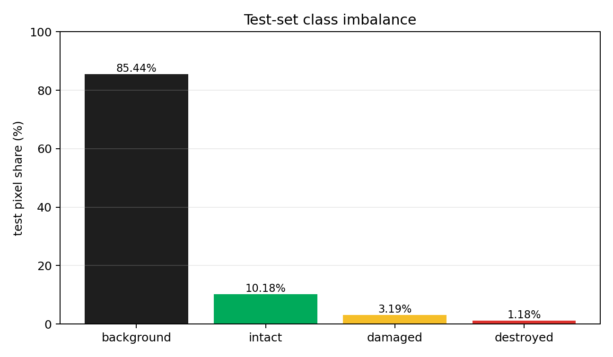
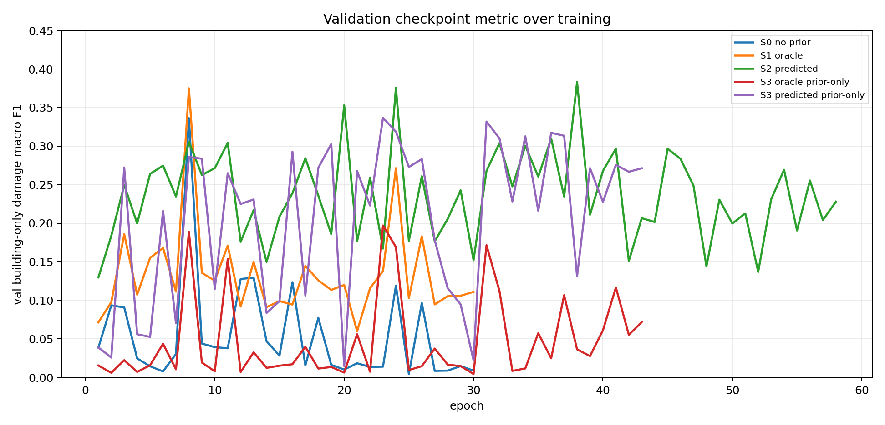
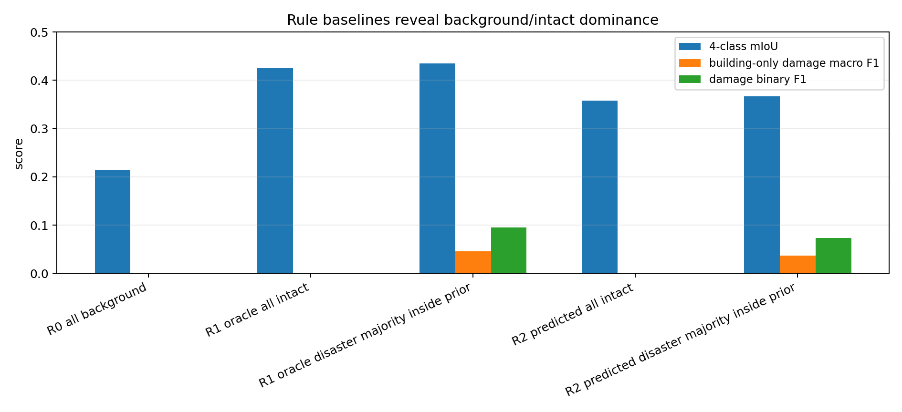
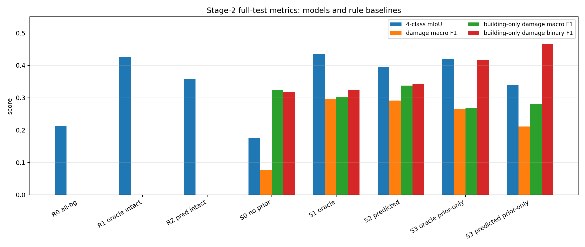
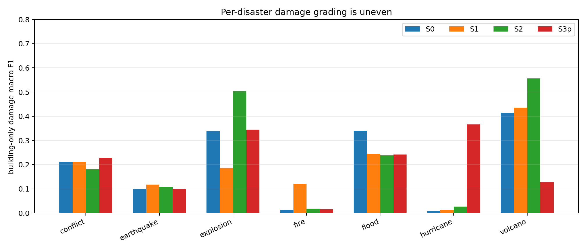
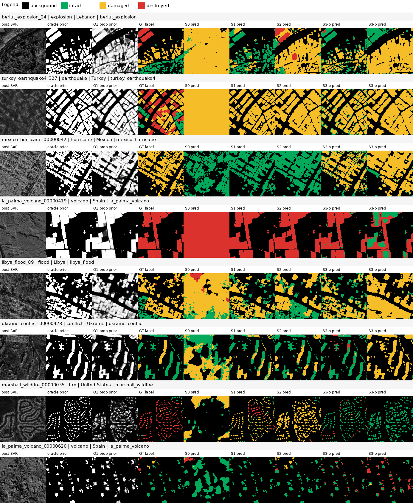

# DisasterM3 Stage-2 SAR Damage Baseline Report

Date: 2026-06-17

## Executive Summary

Stage-2 的目标是评估：

```text
post-event SAR + building prior -> background / intact / damaged / destroyed
```

这轮实验已经完成服务器训练、全量 test 评估、规则基线、prior-only 诊断、prior contribution 分析和抽样可视化。结论不是简单的“模型已经解决任务”，而是：

1. building prior 明显改善最终 4-class 分割图，尤其是 background/building 边界。S1 相比 S0 的 4-class mIoU 提升 `+0.2585`，S2 相比 S0 提升 `+0.2193`。
2. 但在真正关注的 building-only damage grading 上，提升很有限。S2 的 building-only damage macro F1 为 `0.3376`，只比 S0 的 `0.3233` 高 `+0.0143`。
3. prior-only 结果很强，说明模型确实能从建筑形状、区域、灾种或标签偏置中读出大量信号。S3-predicted prior-only 的 building-only damage binary F1 为 `0.4662`，高于 S2 的 `0.3428`，但它对 damaged/destroyed 的细分很差。
4. SAR 不是完全没用。S2 相比 S3-predicted prior-only 的 building-only damage macro F1 提升 `+0.0576`，damage macro F1 提升 `+0.0801`。但 SAR 的贡献是中等且不稳定的，远小于它对最终图边界指标的表面提升。
5. damaged 仍是主要短板。S2 的 building-only damaged F1 为 `0.2127`，destroyed F1 为 `0.4626`。模型更容易学到 destroyed，damaged 仍难以稳定识别。

最重要的科学判断：当前 Stage-2 baseline 能证明 building prior 对最终 mask 有用，但还不能证明单时相 post SAR 对细粒度 damage level 有足够稳定的判别信号。后续应把重点放在 building-only、per-disaster、damage macro 指标，而不是 4-class mIoU。

## Data and Experimental Boundary

使用的数据边界是最小 SAR-QC-clean Stage-2 包：

```text
/home/yr/code/datasets/DisasterM3_optical_sar_damage_minimal_v0.2
```

没有访问完整 `DisasterM3_aria2` 树训练 Stage-2。主实验使用 SAR-QC-clean split：

```text
train = 1543
val   = 506
test  = 564
```

主任务保留 QC 中的 `ok + minor_issue`，排除 bad/uncertain。服务器 manifest 检查已通过，五组正式训练的 test `sample_count` 均为 `564`。

test pixel class share 如下，显示 background/intact 仍然主导指标：



| Class | Test pixels | Share |
| --- | ---: | ---: |
| background | 505317856 | 85.4448% |
| intact | 60231784 | 10.1847% |
| damaged | 18851591 | 3.1876% |
| destroyed | 6995633 | 1.1829% |

## Experiment Matrix

| ID | Input | Purpose |
| --- | --- | --- |
| S0 | `[SAR, 0, 0]` | no-prior control |
| S1 | `[SAR, oracle prior, SAR * oracle prior]` | perfect building prior upper bound |
| S2 | `[SAR, O1 predicted prior, SAR * predicted prior]` | deployed two-stage pipeline |
| S3-o | `[0, oracle prior, 0]` | oracle prior-only bias diagnostic |
| S3-p | `[0, predicted prior, 0]` | predicted prior-only bias diagnostic |

Rule baselines:

| Rule | Meaning |
| --- | --- |
| R0_all_background | predict background everywhere |
| R1_oracle_all_intact | oracle building prior -> intact, outside -> background |
| R2_predicted_all_intact | predicted building prior -> intact, outside -> background |
| disaster majority variants | inside prior, predict train-set disaster-specific majority building class |

The primary checkpoint metric was:

```text
val_building_only_damage_macro_f1
```

This was chosen to avoid selecting checkpoints only because they fit background or intact pixels.

## Training Completion

All five formal training runs completed and wrote `best_metric.pth`, `last.pth`, training history, `early_stop.json`, and full test metrics.

| ID | Finished epoch | Best epoch | Best val building-only damage macro F1 | Early stopped | Test samples |
| --- | ---: | ---: | ---: | --- | ---: |
| S0 | 30 | 8 | 0.3363 | true | 564 |
| S1 | 30 | 8 | 0.3750 | true | 564 |
| S2 | 58 | 38 | 0.3833 | true | 564 |
| S3-o | 43 | 23 | 0.1970 | true | 564 |
| S3-p | 43 | 23 | 0.3367 | true | 564 |

Validation curves:



S0/S1 reached their best validation checkpoint early, while S2 improved later and selected epoch 38. This is consistent with the predicted prior needing more epochs to exploit the softer building cue.

## Rule Baselines



| Rule | 4-class mIoU | damage macro F1 | damage binary F1 | building-only damage macro F1 | building-only damage binary F1 |
| --- | ---: | ---: | ---: | ---: | ---: |
| R0_all_background | 0.2136 | 0.0000 | 0.0000 | 0.0000 | 0.0000 |
| R1_oracle_all_intact | 0.4249 | 0.0000 | 0.0000 | 0.0000 | 0.0000 |
| R1_oracle_disaster_majority_inside_prior | 0.4349 | 0.0455 | 0.0949 | 0.0455 | 0.0949 |
| R2_predicted_all_intact | 0.3580 | 0.0000 | 0.0000 | 0.0000 | 0.0000 |
| R2_predicted_disaster_majority_inside_prior | 0.3664 | 0.0351 | 0.0734 | 0.0366 | 0.0761 |

Interpretation:

1. `R1_oracle_all_intact` already reaches `0.4249` 4-class mIoU, close to S1's `0.4345`.
2. This confirms that final 4-class mIoU is strongly inflated by building localization and intact/background dominance.
3. Rule baselines have near-zero damage grading ability. Any claim about Stage-2 success must therefore emphasize damaged/destroyed F1, not mIoU.

## Main Test Metrics



| ID | Input | 4-class mIoU | damage macro F1 | damage binary F1 | building-only damage macro F1 | building-only damage binary F1 | BO damaged F1 | BO destroyed F1 |
| --- | --- | ---: | ---: | ---: | ---: | ---: | ---: | ---: |
| S0 | SAR only / no prior | 0.1759 | 0.0759 | 0.0909 | 0.3233 | 0.3163 | 0.2114 | 0.4352 |
| S1 | SAR + oracle prior | 0.4345 | 0.2962 | 0.3162 | 0.3028 | 0.3241 | 0.2152 | 0.3903 |
| S2 | SAR + predicted prior | 0.3953 | 0.2909 | 0.2688 | 0.3376 | 0.3428 | 0.2127 | 0.4626 |
| S3-o | oracle prior only | 0.4191 | 0.2661 | 0.4121 | 0.2684 | 0.4160 | 0.3311 | 0.2056 |
| S3-p | predicted prior only | 0.3387 | 0.2108 | 0.3331 | 0.2800 | 0.4662 | 0.4142 | 0.1458 |

Main observations:

1. S1 and S2 are much better than S0 on full-map metrics. This is mostly the benefit of knowing where buildings are.
2. S2 is the best formal model on building-only damage macro F1 (`0.3376`), but the advantage over S0 is small.
3. S3-p has the best building-only damage binary F1 (`0.4662`), but poor destroyed F1 (`0.1458`). It often predicts "damage exists" from prior/event bias without grading damaged versus destroyed correctly.
4. S2 improves destroyed F1 (`0.4626`) but damaged F1 remains low (`0.2127`). The model is not yet a reliable damaged-class detector.

## Prior Contribution Analysis

| Comparison | Metric | Left | Right | Delta |
| --- | --- | ---: | ---: | ---: |
| S1_minus_S0 | miou_4class | 0.4345 | 0.1759 | +0.2585 |
| S1_minus_S0 | damage_macro_f1 | 0.2962 | 0.0759 | +0.2203 |
| S1_minus_S0 | building_only_damage_macro_f1 | 0.3028 | 0.3233 | -0.0205 |
| S1_minus_S0 | building_only_damage_binary_f1 | 0.3241 | 0.3163 | +0.0078 |
| S2_minus_S0 | miou_4class | 0.3953 | 0.1759 | +0.2193 |
| S2_minus_S0 | damage_macro_f1 | 0.2909 | 0.0759 | +0.2150 |
| S2_minus_S0 | building_only_damage_macro_f1 | 0.3376 | 0.3233 | +0.0143 |
| S2_minus_S0 | building_only_damage_binary_f1 | 0.3428 | 0.3163 | +0.0266 |
| S1_minus_S2 | miou_4class | 0.4345 | 0.3953 | +0.0392 |
| S1_minus_S2 | damage_macro_f1 | 0.2962 | 0.2909 | +0.0053 |
| S1_minus_S2 | building_only_damage_macro_f1 | 0.3028 | 0.3376 | -0.0348 |
| S1_minus_S2 | building_only_damage_binary_f1 | 0.3241 | 0.3428 | -0.0187 |
| S1_minus_S3_oracle | miou_4class | 0.4345 | 0.4191 | +0.0154 |
| S1_minus_S3_oracle | damage_macro_f1 | 0.2962 | 0.2661 | +0.0301 |
| S1_minus_S3_oracle | building_only_damage_macro_f1 | 0.3028 | 0.2684 | +0.0344 |
| S1_minus_S3_oracle | building_only_damage_binary_f1 | 0.3241 | 0.4160 | -0.0919 |
| S2_minus_S3_predicted | miou_4class | 0.3953 | 0.3387 | +0.0566 |
| S2_minus_S3_predicted | damage_macro_f1 | 0.2909 | 0.2108 | +0.0801 |
| S2_minus_S3_predicted | building_only_damage_macro_f1 | 0.3376 | 0.2800 | +0.0576 |
| S2_minus_S3_predicted | building_only_damage_binary_f1 | 0.3428 | 0.4662 | -0.1233 |

Interpretation:

1. The prior gives a very large apparent gain on full segmentation metrics.
2. On building-only damage macro F1, S1 does not beat S0, and S2 only slightly beats S0. This weakens the claim that prior directly solves damage grading.
3. S2 beating S3-p on building-only damage macro F1 by `+0.0576` is the cleanest evidence that SAR contributes some grading information beyond predicted prior alone.
4. S3-p beating S2 on damage binary F1 means prior-only/event-shape bias can be very competitive if the question is only "any damage or not". This is a warning sign for downstream scientific interpretation.

## Per-Disaster Analysis



| Disaster | S0 BO damage macro F1 | S1 BO damage macro F1 | S2 BO damage macro F1 | S3-p BO damage macro F1 | S2 BO damaged F1 | S2 BO destroyed F1 |
| --- | ---: | ---: | ---: | ---: | ---: | ---: |
| conflict | 0.2124 | 0.2125 | 0.1809 | 0.2291 | 0.3596 | 0.0022 |
| earthquake | 0.0997 | 0.1174 | 0.1080 | 0.0978 | 0.2140 | 0.0020 |
| explosion | 0.3385 | 0.1858 | 0.5041 | 0.3441 | 0.6456 | 0.3626 |
| fire | 0.0136 | 0.1207 | 0.0185 | 0.0155 | 0.0215 | 0.0154 |
| flood | 0.3393 | 0.2454 | 0.2383 | 0.2423 | 0.4056 | 0.0710 |
| hurricane | 0.0082 | 0.0124 | 0.0261 | 0.3658 | 0.0516 | 0.0005 |
| volcano | 0.4137 | 0.4360 | 0.5567 | 0.1278 | 0.2198 | 0.8936 |

Disaster-level conclusions:

1. Volcano and explosion are the strongest categories for S2. Volcano is mostly driven by destroyed recognition.
2. Hurricane is a major failure for S2, while S3-p is surprisingly high. This suggests hurricane damage labels may be highly correlated with predicted prior shape or event/region bias, but SAR + prior does not learn robust damaged recognition there.
3. Earthquake, conflict, and fire have very low destroyed F1 in S2. The model often detects damaged-ish regions but fails the damaged/destroyed split.
4. Flood is moderate but S0 is stronger than S2 on building-only damage macro F1, indicating the prior does not universally help within-building grading.

## Qualitative Results

The report uses eight selected test samples covering explosion, earthquake, hurricane, volcano, flood, conflict, and fire. These were chosen to expose success, failure, and prior-bias modes rather than to estimate aggregate performance.



| Sample | Disaster | GT damaged px | GT destroyed px | S0 BO dmg macro F1 | S1 BO dmg macro F1 | S2 BO dmg macro F1 | S3-p BO dmg macro F1 |
| --- | --- | ---: | ---: | ---: | ---: | ---: | ---: |
| beriut_explosion_24 | explosion | 145484 | 71094 | 0.294 | 0.124 | 0.672 | 0.342 |
| turkey_earthquake4_327 | earthquake | 253608 | 235731 | 0.304 | 0.303 | 0.304 | 0.302 |
| mexico_hurricane_00000042 | hurricane | 462569 | 0 | 0.000 | 0.000 | 0.000 | 0.474 |
| la_palma_volcano_00000419 | volcano | 0 | 378109 | 0.500 | 0.500 | 0.499 | 0.363 |
| libya_flood_89 | flood | 325168 | 5878 | 0.426 | 0.353 | 0.337 | 0.436 |
| ukraine_conflict_00000423 | conflict | 51105 | 0 | 0.090 | 0.075 | 0.238 | 0.189 |
| marshall_wildfire_00000035 | fire | 2817 | 94119 | 0.098 | 0.186 | 0.016 | 0.001 |
| la_palma_volcano_00000620 | volcano | 9142 | 5406 | 0.234 | 0.098 | 0.698 | 0.106 |

Qualitative observations:

1. S0 often predicts damage outside buildings or fills large contiguous regions because it has no building localization cue.
2. S1/S2 usually produce cleaner spatial support, but they can still map whole neighborhoods into the dominant class.
3. Prior-only outputs are not random. They often recover structured class maps from building geometry and event bias, which is exactly why S3 is scientifically important.
4. The hurricane example is the clearest warning case: S2 predicts mostly intact where GT is damaged, while S3-p catches more damaged-like pixels. This does not prove S3-p is better, but it proves prior/data bias can dominate.
5. Volcano examples show the best-case behavior: destroyed regions are visually large and consistent, and S2 captures them well.

Individual selected comparison images are also saved in:

```text
reports/stage2_baseline/assets/selected_comparison_*.png
```

## Scientific Interpretation

### What is established

The experimental design successfully separates three effects:

1. `building localization`: prior drastically improves full-map segmentation scores.
2. `damage grading`: within GT buildings, improvements are smaller and less stable.
3. `prior/data bias`: prior-only models can achieve meaningful damage metrics, so building shape and event context explain a non-trivial fraction of results.

The best deployed pipeline is S2 by the chosen Stage-2 checkpoint objective:

```text
S2 building-only damage macro F1 = 0.3376
```

But this should be described as a diagnostic baseline, not a solved damage mapper.

### What remains weak

1. Damaged class detection is weak. S2 damaged F1 is `0.2127`.
2. Disaster transfer is uneven. Hurricane, fire, earthquake, and conflict remain poor in important submetrics.
3. Binary damage and graded damage tell different stories. S3-p is strong on binary damage but weak on destroyed grading.
4. 4-class mIoU is not reliable for scientific claims because all-intact inside oracle prior is already close to trained models.

### Most likely bottlenecks

1. Single post-event SAR may not contain enough stable signal for intact/damaged/destroyed grading.
2. Building prior and event/region correlations are strong enough to create high scores without SAR.
3. Damaged labels are semantically ambiguous and class-imbalanced.
4. Pixel-level metrics may not match the building-level decision that disaster scientists ultimately care about.

## Recommended Next Experiments

1. Add building-instance or connected-component evaluation:
   - aggregate per building footprint,
   - report intact/damaged/destroyed accuracy per object,
   - separate large and small buildings.
2. Repeat S0/S1/S2/S3 with at least 3 seeds. Current conclusions are strong enough for diagnosis, but not enough for final statistical claims.
3. Add disaster-balanced training or sampling. Current damage-aware crop helps class pixels, but does not guarantee event balance.
4. Calibrate damage binary separately from damage grade. S3-p shows binary damage can be easier than damaged/destroyed separation.
5. Evaluate hard prior gating versus soft prior channel. S2's predicted prior may work partly as a soft regularizer, while S1's hard oracle boundary improves mIoU but not building-only grading.
6. If available, introduce pre/post change cues rather than post-only SAR. This directly tests whether the missing signal is temporal rather than architectural.

## Artifacts

Local synced outputs:

```text
stage1_optical_building/outputs/stage2/
```

Report and assets:

```text
stage1_optical_building/reports/stage2_baseline/stage2_baseline_report.md
stage1_optical_building/reports/stage2_baseline/assets/
```

Server source of truth:

```text
/home/yr/code/stage1_optical_building/outputs/stage2/
/home/yr/code/stage1_optical_building/reports/stage2_baseline/
```

The large checkpoint files were left on the server and were not pulled locally in this pass. The synced local results include metrics, logs, rule outputs, prior contribution tables, selected prediction masks, and report figures.
