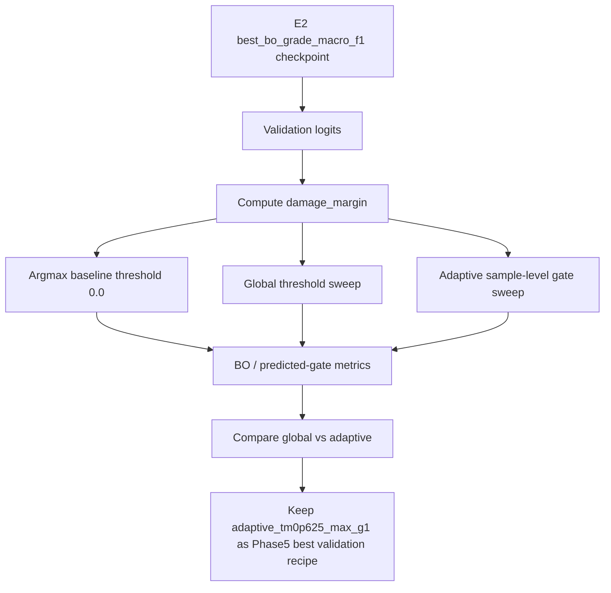
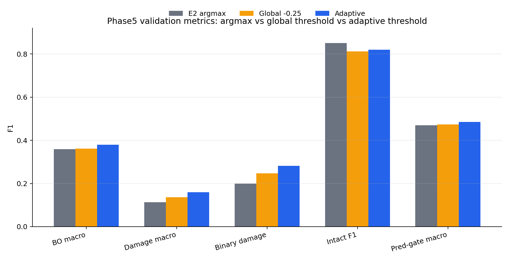
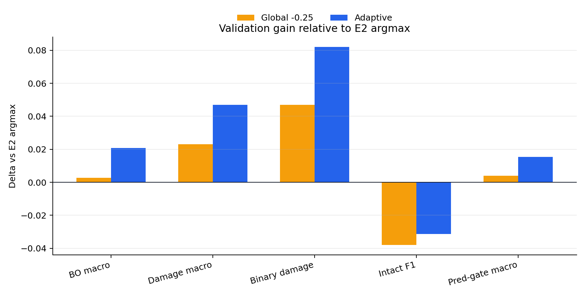
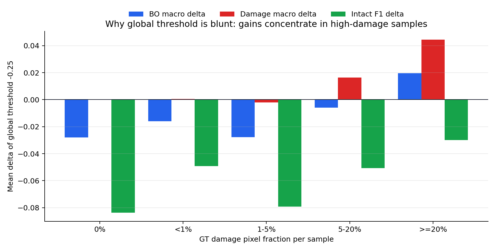
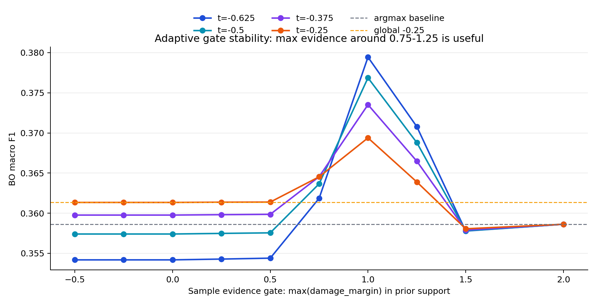
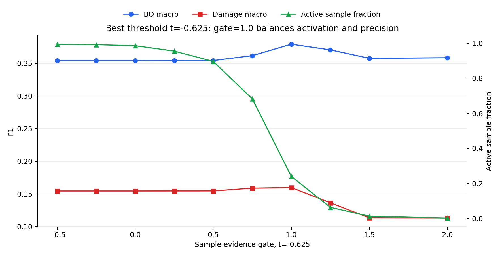

# Stage-2 v2 Phase5：阈值校准与自适应 damage gate 报告

日期：2026-06-30  
状态：Phase5 已完成，结果为 validation-only 探索结论。  
边界：本阶段没有使用 test，没有启动新训练，没有改变模型权重。

## 0. 新同学先看这三句话

1. 当前最好的训练模型仍然是 Phase3 的 E2：`V2_OBJ_E2_p2_binary_aux`，checkpoint 为 `best_bo_grade_macro_f1.pth`。
2. Phase5 发现：模型 logits 里存在可用的 damage 证据。直接全局降低 damage 阈值有收益但会误伤 no-damage 样本；加一个样本级 evidence gate 后，收益显著变干净。
3. 当前 validation 最佳解码方案是：

```text
若 predicted-prior support 内 max(damage_margin) >= 1.0：
    像素级 intact-vs-damage 阈值使用 -0.625
否则：
    保持原始 argmax 阈值 0.0
```

该方案命名为 `adaptive_tm0p625_max_g1`，在 seed 42 validation 上把 BO macro F1 从 `0.3586` 提到 `0.3794`。

## 1. 项目背景

本项目做的是灾后建筑损伤变化检测。当前 pipeline 是：

```text
Stage-1: pre-event optical RGB -> binary building prior
Stage-2: post-event SAR + building prior -> intact / damaged / destroyed
最终输出: background / intact / damaged / destroyed 四分类图
```

Stage-2 v2 的主任务不是全图 mIoU，而是判断建筑像素内部能否分出：

```text
intact / damaged / destroyed
```

所以本阶段主要看以下指标：

| 指标 | 含义 | 为什么重要 |
| --- | --- | --- |
| BO macro F1 | GT building 内 intact/damaged/destroyed 三类 F1 平均 | 当前主指标 |
| BO damage macro F1 | damaged 和 destroyed 两类 F1 平均 | 关注灾损识别，而不是只识别 intact |
| BO binary damage F1 | intact vs any damage | 看模型是否能先判断“有没有损伤” |
| BO intact F1 | intact 类 F1 | 防止为了 damage recall 产生大量误报 |
| predicted-gate macro F1 | 用 Stage-1 predicted prior support 后的端到端四分类宏 F1 | 更接近可部署 pipeline |

本阶段所有选择只基于 validation split。test set 没有参与。

## 2. 本阶段输入与输出

### 2.1 输入模型

| 项目 | 值 |
| --- | --- |
| 基础模型 | E2，Phase3 objective experiment |
| run dir | `outputs/stage2/v2_phase3_objective/V2_OBJ_E2_p2_binary_aux/seed_42/run_20260628_113741` |
| checkpoint | `checkpoints/best_bo_grade_macro_f1.pth` |
| checkpoint epoch | 3 |
| split | `val` |
| validation 样本数 | 357 |
| seed | 42 |

E2 是 Phase3 得到的当前最佳训练模型。Phase4 binary-aux sweep 没有明显超过 E2，所以 Phase5 没有继续扩大训练 sweep，而是先检查解码边界是否能释放模型已有 logits 信息。

### 2.2 本阶段产物

| 类型 | 路径 |
| --- | --- |
| Phase5 简要总结 | `outputs/stage2/v2_phase5_threshold_sweep_analysis_20260629/SUMMARY.md` |
| 普通阈值 sweep 输出 | `outputs/stage2/v2_phase3_objective/V2_OBJ_E2_p2_binary_aux/seed_42/run_20260628_113741/val_threshold_sweep_grade` |
| 全局 `-0.25` detailed val 输出 | `outputs/stage2/v2_phase3_objective/V2_OBJ_E2_p2_binary_aux/seed_42/run_20260628_113741/val_best_grade_thr_m0p25` |
| adaptive sweep 输出 | `outputs/stage2/v2_phase3_objective/V2_OBJ_E2_p2_binary_aux/seed_42/run_20260628_113741/val_adaptive_threshold_sweep_grade` |
| 本报告 | `reports/stage2_v2/PHASE5_THRESHOLD_ADAPTIVE_REPORT_20260630.md` |
| 本报告图表 | `reports/stage2_v2/assets/phase5_threshold_adaptive_20260630/` |

## 3. 核心概念：damage margin

E2 对每个建筑像素输出 3 个 logits：

```text
logit_intact, logit_damaged, logit_destroyed
```

原始 argmax 等价于：

```text
如果 max(logit_damaged, logit_destroyed) - logit_intact >= 0：
    预测 damaged 或 destroyed
否则：
    预测 intact
```

因此定义：

```text
damage_margin = max(logit_damaged, logit_destroyed) - logit_intact
```

原始 argmax 的阈值就是：

```text
threshold = 0.0
```

Phase5 做的事情是检查：

```text
是否应该把这个 threshold 从 0.0 调低？
```

调低阈值会让模型更容易预测 damage。好处是提高 damaged/destroyed recall，坏处是容易把 intact 误报成 damage。

## 4. 本阶段实验流程



本阶段分三步：

1. 检查普通全局阈值是否有用。
2. 分析普通全局阈值的问题在哪里。
3. 设计并验证自适应样本级 gate。

## 5. Step 1：普通全局阈值 sweep

### 5.1 做法

对所有 validation 样本统一使用同一个阈值：

```text
grade = damage_choice if damage_margin >= threshold else intact
```

其中：

```text
damage_choice = argmax(logit_damaged, logit_destroyed)
```

`threshold=0.0` 是原始 argmax。  
`threshold=-0.25`、`-0.375`、`-0.625` 等会让模型更容易预测 damage。

### 5.2 主要结果

| recipe | BO macro F1 | BO damage macro F1 | BO binary damage F1 | intact F1 | damaged F1 | destroyed F1 | predicted-gate macro F1 |
| --- | ---: | ---: | ---: | ---: | ---: | ---: | ---: |
| E2 argmax, threshold `0.0` | 0.3586 | 0.1127 | 0.1996 | 0.8504 | 0.1261 | 0.0993 | 0.4693 |
| E2 global threshold `-0.25` | 0.3613 | 0.1358 | 0.2465 | 0.8124 | 0.1462 | 0.1254 | 0.4733 |
| E2 global threshold `-0.625` | 0.3542 | 0.1544 | 0.2836 | 0.7538 | 0.1670 | 0.1418 | 0.4718 |

结论：

- `-0.25` 是普通全局阈值下的主指标最佳点。
- 它相对 argmax 提升 BO macro `+0.0027`，damage macro `+0.0231`。
- 但 intact F1 下降 `-0.0380`，说明误报 damage 增多。
- 更激进的 `-0.625` 可以继续提高 damage macro，但 BO macro 已经低于 argmax。





## 6. Step 2：为什么全局阈值不够好

普通全局阈值对所有样本一视同仁。但 validation 里很多样本没有 GT damage，或者 damage 像素占比很低。对这些样本降低阈值，主要效果就是把 intact 误报为 damage。

### 6.1 Per-event 观察

全局 `-0.25` 的收益并不均匀：

| event | BO macro delta | damage macro delta | intact F1 delta | 解读 |
| --- | ---: | ---: | ---: | --- |
| `turkey_earthquake4` | +0.0182 | +0.0396 | -0.0247 | 明显收益，damage 信号较强 |
| `morocco_earthquake` | -0.0065 | +0.0008 | -0.0209 | damage 收益很小，intact 被误伤 |
| `bata_explosion` | -0.0140 | +0.0194 | -0.0808 | 有 damage 收益，但误报代价大 |
| `marshall_wildfire` | -0.0187 | +0.0113 | -0.0787 | 误报代价大于主指标收益 |
| `haiti_earthquake` | -0.0214 | +0.0013 | -0.0667 | 基本只有误伤 |

### 6.2 按 GT damage 占比分层

| 样本 GT damage 占比 | 样本数 | mean delta BO macro | mean delta damage macro | mean delta intact F1 |
| --- | ---: | ---: | ---: | ---: |
| 0% | 211 | -0.0279 | 0.0000 | -0.0836 |
| <1% | 8 | -0.0160 | +0.0006 | -0.0492 |
| 1-5% | 35 | -0.0277 | -0.0020 | -0.0791 |
| 5-20% | 41 | -0.0059 | +0.0164 | -0.0506 |
| >=20% | 62 | +0.0196 | +0.0443 | -0.0300 |

这张表是 Phase5 的关键洞察：

- 高 damage 样本确实需要更低阈值。
- no/low-damage 样本不应该降低阈值。
- 因此应该从“全局固定阈值”转向“样本级自适应阈值”。



## 7. Step 3：自适应样本级 gate

### 7.1 基本思想

对每张图先判断“这张图是否有足够强的 damage 证据”。如果有，再放宽像素阈值；如果没有，就保留原始 argmax。

核心规则：

```text
evidence = statistic(damage_margin inside predicted-prior support)

if evidence >= evidence_gate:
    pixel_threshold = relaxed_threshold
else:
    pixel_threshold = 0.0
```

本阶段测试了：

| 维度 | 候选 |
| --- | --- |
| relaxed pixel threshold | `-0.25`, `-0.375`, `-0.5`, `-0.625` |
| evidence statistic | `p95`, `p99`, `max` |
| evidence gate | `-0.5`, `-0.25`, `0`, `0.25`, `0.5`, `0.75`, `1.0`, `1.25`, `1.5`, `2.0` |
| evidence region | predicted-prior support |

总候选数：

```text
1 argmax baseline + 4 global thresholds + 4 * 3 * 10 adaptive candidates = 125
```

### 7.2 最佳候选

最佳候选：

```text
adaptive_tm0p625_max_g1
```

等价于：

```text
evidence = max(damage_margin in predicted-prior support)

if evidence >= 1.0:
    threshold = -0.625
else:
    threshold = 0.0
```

该规则只激活 86/357 个 validation 样本，即 `24.09%`。它避免了对大多数 no-damage 样本统一降阈值。

### 7.3 Adaptive vs global vs argmax

| recipe | active samples | BO macro F1 | BO damage macro F1 | BO binary damage F1 | intact F1 | predicted-gate macro F1 |
| --- | ---: | ---: | ---: | ---: | ---: | ---: |
| E2 argmax | 0 | 0.3586 | 0.1127 | 0.1996 | 0.8504 | 0.4693 |
| E2 global threshold `-0.25` | 357 | 0.3613 | 0.1358 | 0.2465 | 0.8124 | 0.4733 |
| E2 adaptive `-0.625`, max gate `1.0` | 86 | 0.3794 | 0.1596 | 0.2817 | 0.8191 | 0.4847 |

相对 E2 argmax：

| 指标 | delta |
| --- | ---: |
| BO macro F1 | +0.0208 |
| BO damage macro F1 | +0.0469 |
| BO binary damage F1 | +0.0822 |
| predicted-gate macro F1 | +0.0154 |
| intact F1 | -0.0313 |

相对 global `-0.25`：

| 指标 | delta |
| --- | ---: |
| BO macro F1 | +0.0181 |
| BO damage macro F1 | +0.0238 |
| BO binary damage F1 | +0.0352 |
| predicted-gate macro F1 | +0.0114 |
| intact F1 | +0.0067 |

这说明 adaptive gate 不只是比 argmax 好，也比普通全局阈值更干净。

## 8. Adaptive 候选是否稳定

最佳点不是一个孤立尖峰。`max` evidence 在 gate `0.75` 到 `1.25` 附近都有明显可用信号。



对最佳像素阈值 `-0.625` 单独看，gate 太低会接近全局阈值，激活太多样本；gate 太高会退回 argmax，几乎不激活。`gate=1.0` 在本次 validation 上取得了比较好的平衡。



关键候选对比：

| candidate | active fraction | BO macro | damage macro | intact F1 | predicted-gate macro |
| --- | ---: | ---: | ---: | ---: | ---: |
| `adaptive_tm0p625_max_g0p75` | 0.683 | 0.3619 | 0.1587 | 0.7681 | 0.4756 |
| `adaptive_tm0p625_max_g1` | 0.241 | 0.3794 | 0.1596 | 0.8191 | 0.4847 |
| `adaptive_tm0p625_max_g1p25` | 0.064 | 0.3708 | 0.1363 | 0.8397 | 0.4781 |
| `adaptive_tm0p5_max_g1` | 0.241 | 0.3769 | 0.1526 | 0.8255 | 0.4827 |
| `adaptive_tm0p375_max_g1` | 0.241 | 0.3735 | 0.1444 | 0.8317 | 0.4802 |
| `adaptive_tm0p25_max_g1` | 0.241 | 0.3694 | 0.1351 | 0.8380 | 0.4771 |

解释：

- `gate=0.75` 激活样本过多，damage macro 高，但 intact 误伤仍明显。
- `gate=1.25` 激活样本过少，intact 保住了，但 damage 收益下降。
- `gate=1.0` 对当前 validation 是最好的平衡点。

## 9. 工程实现

### 9.1 已加入的工具

| 文件 | 作用 |
| --- | --- |
| `src/stage2/sweep_stage2_v2_thresholds.py` | 普通全局 damage-margin 阈值 sweep |
| `scripts/launch_stage2_v2_threshold_sweep.sh` | tmux 启动普通阈值 sweep |
| `src/stage2/sweep_stage2_v2_adaptive_thresholds.py` | 自适应样本级 gate sweep |
| `scripts/launch_stage2_v2_adaptive_threshold_sweep.sh` | tmux 启动 adaptive sweep |
| `src/stage2/test_stage2_v2.py` | 已支持全局 `--damage-margin-threshold` detailed eval |
| `tests/test_stage2_v2_core.py` | 增加了 damage-margin 解码单测 |

### 9.2 已通过的检查

| 检查 | 状态 |
| --- | --- |
| `python -m py_compile src/stage2/sweep_stage2_v2_thresholds.py` | 通过 |
| `python -m py_compile src/stage2/sweep_stage2_v2_adaptive_thresholds.py` | 通过 |
| `bash -n scripts/launch_stage2_v2_threshold_sweep.sh` | 通过 |
| `bash -n scripts/launch_stage2_v2_adaptive_threshold_sweep.sh` | 通过 |
| `python tests/test_stage2_v2_core.py` | 10 tests 通过 |
| 全局阈值 2-sample CPU smoke | 通过 |
| adaptive 阈值 2-sample CPU smoke | 通过 |
| E2 validation 全局阈值 sweep | 完成 |
| E2 validation global `-0.25` detailed eval | 完成 |
| E2 validation adaptive sweep | 完成 |

## 10. 本阶段结论

### 10.1 直接结论

Phase5 已证明：

1. E2 的 logits 中存在可用的 damage 证据。
2. 普通全局降低阈值可以提高 damage recall，但会伤害 no/low-damage 样本。
3. 样本级 evidence gate 能明显改善这个 tradeoff。
4. 当前 validation 最佳解码配方是：

```text
E2 + adaptive damage-margin threshold
pixel threshold: -0.625
sample evidence: max(damage_margin in predicted-prior support) >= 1.0
```

### 10.2 当前应保留的 recipe

| 模块 | 选择 |
| --- | --- |
| 训练模型 | E2 `V2_OBJ_E2_p2_binary_aux` |
| checkpoint | `best_bo_grade_macro_f1.pth` |
| 解码 | adaptive damage-margin decoder |
| sample evidence region | predicted-prior support |
| sample evidence statistic | `max` |
| sample evidence gate | `1.0` |
| active pixel threshold | `-0.625` |
| inactive pixel threshold | `0.0`，等价于原始 argmax |

### 10.3 不能过度解读的地方

这仍然是探索阶段结果，有以下限制：

1. 只在 seed 42 validation 上选择，不能当作正式 test 结论。
2. `gate=1.0` 是 validation-selected，可能有一定调参过拟合。
3. 本阶段没有证明 SAR 本身的因果贡献，只证明 E2 logits 的解码边界还能释放更多 validation 信息。
4. `max` evidence 可能被少量尖峰区域触发，下一阶段必须定性检查 86 个 activated samples。
5. 本阶段不应该触发 test。只有当配方冻结后，才能做一次性 test。

## 11. 新同学如何复现

### 11.1 普通全局阈值 sweep

```bash
cd "/home/yr/code/Building damage change detection/stage1_optical_building"
bash scripts/launch_stage2_v2_threshold_sweep.sh \
  outputs/stage2/v2_phase3_objective/V2_OBJ_E2_p2_binary_aux/seed_42/run_20260628_113741 \
  0 val grade
```

输出：

```text
outputs/stage2/v2_phase3_objective/V2_OBJ_E2_p2_binary_aux/seed_42/run_20260628_113741/val_threshold_sweep_grade
```

### 11.2 全局 `-0.25` detailed eval

```bash
cd "/home/yr/code/Building damage change detection/stage1_optical_building"
bash scripts/evaluate_stage2_v2_run.sh \
  outputs/stage2/v2_phase3_objective/V2_OBJ_E2_p2_binary_aux/seed_42/run_20260628_113741 \
  0 val grade -0.25
```

输出：

```text
outputs/stage2/v2_phase3_objective/V2_OBJ_E2_p2_binary_aux/seed_42/run_20260628_113741/val_best_grade_thr_m0p25
```

### 11.3 Adaptive threshold sweep

```bash
cd "/home/yr/code/Building damage change detection/stage1_optical_building"
bash scripts/launch_stage2_v2_adaptive_threshold_sweep.sh \
  outputs/stage2/v2_phase3_objective/V2_OBJ_E2_p2_binary_aux/seed_42/run_20260628_113741 \
  0 val grade
```

输出：

```text
outputs/stage2/v2_phase3_objective/V2_OBJ_E2_p2_binary_aux/seed_42/run_20260628_113741/val_adaptive_threshold_sweep_grade
```

不要重复启动同一个输出目录。launcher 会拒绝覆盖已有输出。

## 12. 下一阶段建议

下一阶段不应该立刻开新训练，也不应该直接跑 test。建议按顺序做：

1. 把 adaptive decoder 接入 detailed eval 入口，类似现在的全局 `--damage-margin-threshold`。
2. 对 `adaptive_tm0p625_max_g1` 生成完整 val 的 per-event、per-disaster、sample metrics 和 previews。
3. 专门检查 86 个 activated samples：
   - 是否集中在 GT damage 高的样本；
   - 是否存在 SAR speckle、prior 边缘、建筑 mask 错位导致的假触发；
   - 是否存在事件级偏置，比如只对 `turkey_earthquake4` 有效。
4. 若 qualitative 检查通过，再考虑冻结为下一阶段候选 recipe。
5. 仍然不要用 test 调参。

## 13. 一句话交接

Phase5 的结论不是“重新训练一个更强模型”，而是：

```text
E2 已经学到一些 damage evidence；
原始 argmax 太保守；
全局降阈值太粗；
用 predicted-prior support 内的 sample-level max damage_margin 做 gate，
可以只在高证据样本上放宽阈值，从而同时提升 BO macro、damage macro 和 predicted-gate macro。
```

