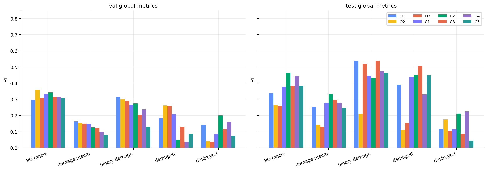
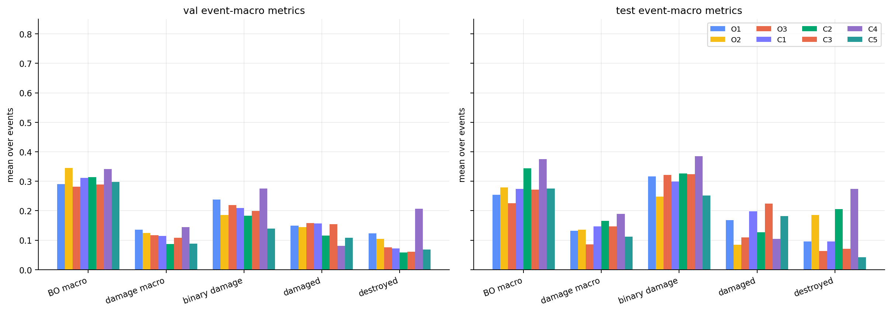
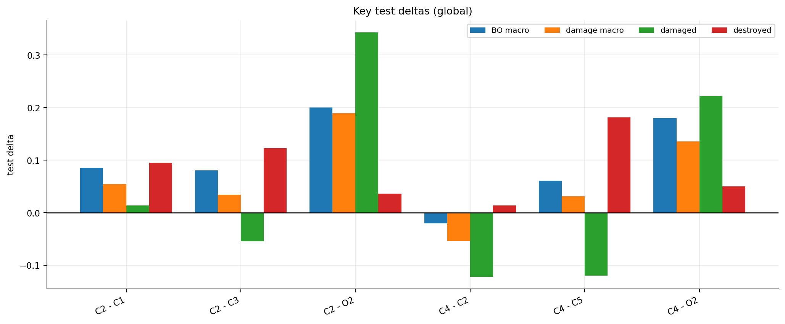
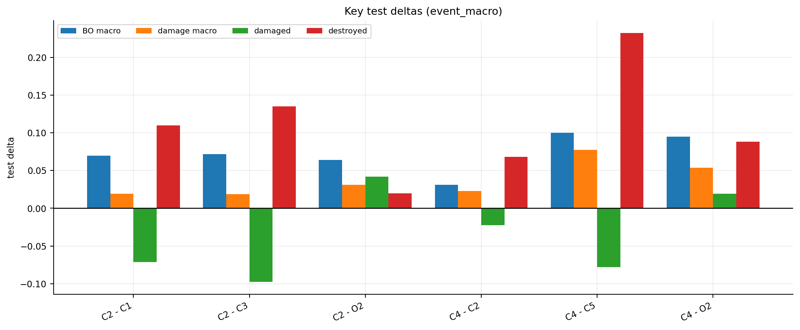
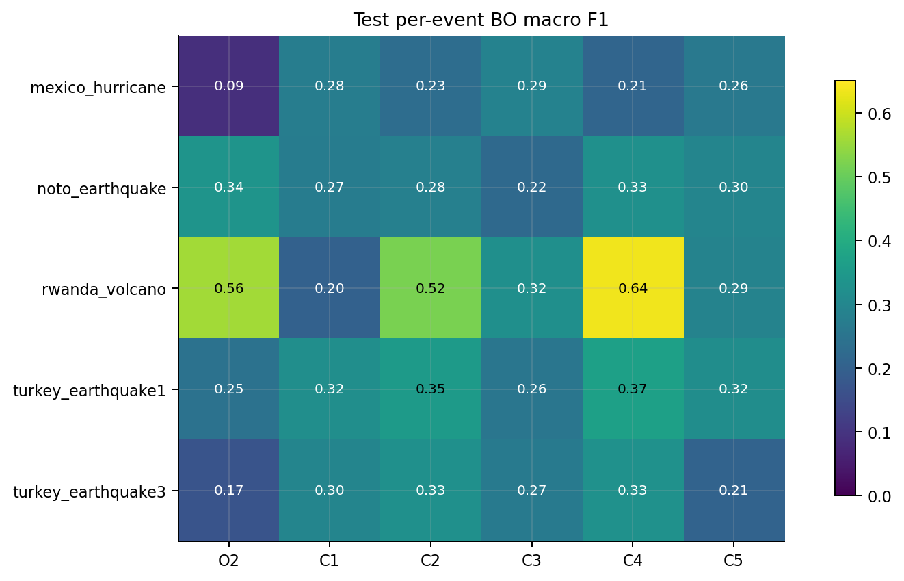

# Stage-2 v2 pre-change optical / SAR-enhancement 实验报告

日期：2026-06-26  
数据协议：`stage2_v2_clean_human_reviewed_20260624`  
实验性质：单 seed 探索实验，不是最终三 seed 正式结论

## 0. 一句话结论

在 strict clean 数据集上，引入 pre-event optical RGB 后，Stage-2 的 oracle-support 建筑内三分类诊断明显改善。最直接的配置 C2（pre optical + paired SAR + oracle prior）在 test global BO macro F1 达到 `0.4646`，高于原 oracle SAR baseline O2 的 `0.2645`，也高于 pre+prior 无 SAR 的 C1 `0.3789` 和 shuffled-SAR control C3 `0.3840`。

但这个结果仍应被解释为“机制诊断”：它说明 pre-change cue 能显著改善模型利用 SAR/上下文做灾损分级的能力；它还不能直接等价为可部署 pipeline 的最终性能，因为 C1-C5 使用的是 oracle building support，且本轮只跑了 seed 42。

## 1. 任务背景：这个项目到底在做什么

本项目目标是灾后建筑损伤变化检测，最终输出像素级四分类语义图：

```text
0 background
1 intact
2 damaged
3 destroyed
```

当前系统被拆成两阶段：

```text
Stage-1: pre-event optical RGB -> binary building prior
Stage-2: post-event SAR + building prior -> intact / damaged / destroyed
最终输出: background / intact / damaged / destroyed
```

Stage-1 负责“哪里是建筑”，Stage-2 负责“建筑损伤等级是什么”。本项目主目标不是实例级建筑灾损检测，也不是 connected-component 级别评价，而是像素级四分类输出。历史上如果出现 `cc_surrogate` 产物，只能作为辅助诊断，不能参与当前 Stage-2 v2 的模型选择。

Stage-2 的核心科学问题是：

```text
post-event SAR 是否在 building prior / event bias / class bias 之外，
提供了稳定、可重复的灾损分级信息？
```

这个问题不能只看一个 SAR+prior 模型是否有分数。必须同时看 prior-only、shuffled-SAR negative control、per-event 和 event-macro，否则很容易把数据偏差、事件记忆或类别先验误判为 SAR 有效。

## 2. 数据集与评估协议

### 2.1 为什么不能再用旧 test 结论

早期 Stage-2 v2 legacy test 已撤回。完整 SHA-256 审计发现旧 2613 行 manifest union 中存在 661 个完整重复组，其中包括 105 个 train-test 完全重复样本。旧 test 的表格、可视化、事件排名和结论都不能作为正式结果引用。

随后构建了 strict-v1 / human-reviewed clean 协议：

```text
manifest: manifests/stage2_v2_clean_human_reviewed_20260624/
train / val / test: 1207 / 357 / 388 samples
exact full-content duplicates: 0
event overlap: 0
hard audit errors: 0
```

该协议基于全内容去重、canonical event disjoint 划分，并合并了人工复核的 partial-overlap 审计结果。它仍不等价于严格地理 footprint 级独立性证明，但已经解决了旧 test 中最严重的完整重复泄漏问题。

### 2.2 minimal package 中每个样本包含什么

Stage-2 minimal package 不依赖完整 DisasterM3 源树。当前实验只使用 minimal package 中的字段：

| 字段 | 含义 | 作用 |
| --- | --- | --- |
| `pre_image` | 灾前 optical RGB | Stage-1 building prior 来源；本轮 C1-C5 额外作为 pre-change cue |
| `post_sar` | 灾后 SAR 灰度图 | Stage-2 主要待验证信号 |
| `mask_multiclass` | 四分类 GT mask | 训练/评估目标，值为 0/1/2/3 |
| `building_prior` / `oracle_building_mask` | GT building support | oracle-support 诊断使用 |
| `pred_building_prob` / `pred_building_binary` | Stage-1 O1 predicted prior | 可部署 pipeline 使用 |
| event / disaster / region metadata | 事件和区域信息 | 分组审计、event-macro 和 leakage 检查 |

本轮 pre-change exploration 使用 oracle building support。也就是说，它主要回答：

```text
如果建筑区域已经给准了，pre optical + SAR 能不能更好地区分 intact / damaged / destroyed？
```

这不同于可部署系统中的 predicted-prior pipeline。可部署系统还要承受 Stage-1 building prior 的漏检和误检。

### 2.3 数据预处理与输入构造

所有图像输入均按 `[0, 1]` 归一化。训练时，`pre_image`、`post_sar`、`prior` 和 `mask` 使用同一套空间裁剪和增强，避免几何错位：

- damage-aware crop：优先抽取 damaged / destroyed / building 区域；
- random flip / rotate90：对 SAR、pre optical、prior、mask 同步执行；
- 评估阶段不做随机裁剪，使用完整切片。

本轮新增的 input modes 是：

```text
pre_prior:
  [pre_R, pre_G, pre_B, 0, prior, 0]

pre_sar_prior:
  [pre_R, pre_G, pre_B, SAR, prior, SAR * prior]

pre_sar_texture_prior:
  [pre_R, pre_G, pre_B, SAR, SAR_grad, prior, SAR * prior, SAR_grad * prior]
```

其中 `SAR_grad` 是由 post-SAR 灰度图现算的梯度幅值，并按 99 分位归一化。它不是额外数据源，只是一个很轻量的 SAR texture cue。

## 3. 探索时间线：为什么一步步走到 pre-change 实验

### 3.1 Stage-1：先得到建筑定位先验

Stage-1 的任务是 `pre-event optical RGB -> binary building mask`。已完成 O1-O4，最终冻结 O1 U-Net ResNet34 作为 building prior baseline。O1 在 Stage-1 test-all 上达到：

```text
Building IoU = 0.6871
Building F1  = 0.8145
```

Stage-1 的作用是把“建筑在哪里”提供给 Stage-2。没有这个 prior，Stage-2 很容易被 background 主导。

### 3.2 Stage-2 v1：SAR+prior 有一定效果，但 bias 很强

Stage-2 v1 曾比较 SAR-only、SAR+oracle prior、SAR+predicted prior、prior-only 等配置。一个关键现象是 prior-only 也能取得非零甚至不弱的灾损指标，这说明数据中存在强 prior / event / region / class bias。

因此后续 Stage-2 v2 不再满足于“模型分数变高”，而是要求：

```text
paired SAR 必须超过 prior-only，
也必须超过 fixed shuffled-SAR negative control。
```

### 3.3 legacy test 撤回：先修数据协议，再谈模型结论

2026-06-22 的完整内容审计发现 legacy test 存在 train-test 完整重复。于是旧 test 结论被撤回，重新构建 strict clean split。

这一步改变了后续实验的原则：

- 不能使用旧 checkpoints 声称新 formal test；
- 所有正式比较必须在 clean manifest 上重新训练；
- 必须报告 per-event 和 event-macro，因为 test 中稀有类可能集中在少数事件里；
- negative control 必须固定、保存、可复现。

### 3.4 strict clean A1-A4：可部署 predicted-prior reference

在 `stage2_v2_clean_human_reviewed_20260624` 上完成了 A1-A4 三 seed formal reference。它们使用 predicted prior，因此更接近可部署 pipeline：

| formal ID | 输入 | test BO macro mean | damage macro | binary damage | damaged | destroyed |
| --- | --- | ---: | ---: | ---: | ---: | ---: |
| A1 | predicted prior only | 0.3773 | 0.2536 | 0.4430 | 0.4008 | 0.1065 |
| A2 | SAR only | 0.3352 | 0.1622 | 0.2850 | 0.1353 | 0.1891 |
| A3 | SAR + predicted prior | 0.3152 | 0.1311 | 0.1951 | 0.0526 | 0.2095 |
| A4 | shuffled SAR + predicted prior | 0.2885 | 0.1454 | 0.4757 | 0.1681 | 0.1226 |

这个结果并不支持“当前 deployable SAR+predicted-prior pipeline 已经稳定利用 SAR”。A3 没有明显压过 A1，并且与 A4 的关系也不够理想。

### 3.5 oracle O1-O3：把建筑定位问题暂时拿掉

为了判断问题到底来自 building prior 误差，还是来自建筑内损伤分类本身，又做了 oracle-support 探索：

| ID | 输入 | 目的 |
| --- | --- | --- |
| O1 | oracle prior only | 只看 GT building support / label bias 能到哪里 |
| O2 | SAR + oracle prior | 有准确建筑区域时，post-SAR 是否有效 |
| O3 | shuffled SAR + oracle prior | O2 的 SAR correspondence negative control |

O1/O2/O3 的 test global BO macro 分别是：

```text
O1 = 0.3374
O2 = 0.2645
O3 = 0.2597
```

这说明只把 building support 换成 oracle 并没有自动解决灾损分类；单时相 post-SAR 在当前训练方式下也没有稳定表现出强 correspondence gain。

### 3.6 定性诊断：不是“SAR 完全没用”，而是缺少变化参照

随后做了 SAR 定性可视化诊断。观察结果更像是：

- 一些局部区域中，SAR 的确包含和毁损/强散射/结构变化相关的线索；
- 但单时相 post-SAR 同时受材料、入射角、散斑、地表湿度、配准和事件差异影响；
- 模型没有 pre-change reference 时，很难判断“这个 SAR 纹理本来就这样”还是“灾后变成这样”。

因此提出本轮实验的直接假设：

```text
pre-event optical RGB 可以提供建筑形态、密度、上下文和灾前参考，
从而帮助模型把 post-SAR 中的异常纹理解释为灾损证据。
```

这就是 C1-C5 pre-change exploration 的来源。

## 4. 本轮 C1-C5 实验设计

本轮只跑 seed 42，目标是快速验证机制，不追求最终严谨统计。所有 C1-C5 都使用相同 clean manifest、相同 oracle building support、相同 Stage-2 building-only 三分类训练框架。

### 4.1 实验矩阵

| ID | 输入 | channels | SAR 关系 | 设计目的 |
| --- | --- | ---: | --- | --- |
| C1 | pre optical RGB + oracle prior，SAR 置零 | 6 | none | 检查 pre/context + prior 本身能解释多少 |
| C2 | pre optical RGB + paired SAR + oracle prior | 6 | paired | 检查 pre optical 是否帮助模型利用真实配对 SAR |
| C3 | pre optical RGB + shuffled SAR + oracle prior | 6 | within-event shuffled | C2 的 correspondence control |
| C4 | pre optical RGB + paired SAR + SAR gradient + oracle prior | 8 | paired | 检查轻量 SAR texture 是否带来额外收益 |
| C5 | pre optical RGB + shuffled SAR + SAR gradient + oracle prior | 8 | within-event shuffled | C4 的 correspondence control |

### 4.2 每个关键对比回答什么问题

| 对比 | 如果为正，说明什么 | 如果不为正，说明什么 |
| --- | --- | --- |
| C2 - C1 | paired SAR 在 pre+prior 之外有增益 | 提升主要来自 pre optical / prior / context |
| C2 - C3 | 真实配对 SAR 优于 shuffled SAR | 模型可能只利用 event-level SAR 风格或噪声统计 |
| C2 - O2 | pre optical 让原始 SAR+prior 更可用 | pre optical 没有解决单时相 SAR 的瓶颈 |
| C4 - C2 | SAR gradient/texture 有额外价值 | 简单 texture 不是直接升级 |
| C4 - C5 | texture 设置下 paired SAR 仍优于 shuffled | texture 主要提供非对应的事件/统计偏差 |

这里最重要的是 C2-C3 和 C4-C5，因为它们是 fixed shuffled-SAR negative control。只有超过 shuffled control，才更有资格说模型在利用“当前样本对应的 SAR”，而不是只利用 SAR 的事件风格。

### 4.3 指标说明

主指标是 building-only 三分类 macro F1：

```text
BO macro = mean(F1_intact, F1_damaged, F1_destroyed)
```

辅助指标：

| 指标 | 含义 |
| --- | --- |
| damage macro | `mean(F1_damaged, F1_destroyed)`，更关注灾损类 |
| binary damage | intact vs any-damage 的二分类 F1 |
| intact / damaged / destroyed | 三个建筑等级的单类 F1 |
| event-macro | 先对每个 event 算指标，再对 event 平均，降低大事件支配全局分数的风险 |
| sample bootstrap CI | 按 sample 做成对 bootstrap，观察差值是否稳定跨 0 |

global pixel metrics 容易被像素量大的事件支配；event-macro 更接近“跨事件泛化”的读法。因此两个都要看。

## 5. 完成状态

| ID | input | channels | shuffle | epochs | best val BO | run |
| --- | --- | ---: | --- | ---: | ---: | --- |
| C1 | pre_prior | 6 | paired | 12 | 0.3309 | `outputs/stage2/v2_prechange_explore/V2_PRE_C1_pre_oracle_prior_only/seed_42/run_20260626_085906` |
| C2 | pre_sar_prior | 6 | paired | 14 | 0.3425 | `outputs/stage2/v2_prechange_explore/V2_PRE_C2_pre_sar_oracle_prior/seed_42/run_20260626_085921` |
| C3 | pre_sar_prior | 6 | within_event | 14 | 0.3135 | `outputs/stage2/v2_prechange_explore/V2_PRE_C3_pre_shuffled_sar_oracle_prior/seed_42/run_20260626_095628` |
| C4 | pre_sar_texture_prior | 8 | paired | 29 | 0.3152 | `outputs/stage2/v2_prechange_explore/V2_PRE_C4_pre_sartex_oracle_prior/seed_42/run_20260626_095637` |
| C5 | pre_sar_texture_prior | 8 | within_event | 23 | 0.3065 | `outputs/stage2/v2_prechange_explore/V2_PRE_C5_pre_shuffled_sartex_oracle_prior/seed_42/run_20260626_121520` |

所有 C1-C5 训练、validation grade checkpoint 评估、test grade checkpoint 评估均已完成。

## 6. Global pixel metrics



| split | ID | BO macro | damage macro | binary damage | intact | damaged | destroyed |
| --- | --- | ---: | ---: | ---: | ---: | ---: | ---: |
| val | O1 | 0.2984 | 0.1625 | 0.3149 | 0.5700 | 0.1837 | 0.1414 |
| val | O2 | 0.3591 | 0.1514 | 0.2986 | 0.7745 | 0.2624 | 0.0404 |
| val | O3 | 0.3067 | 0.1496 | 0.2907 | 0.6210 | 0.2605 | 0.0387 |
| val | C1 | 0.3309 | 0.1463 | 0.2671 | 0.7002 | 0.2067 | 0.0859 |
| val | C2 | 0.3425 | 0.1256 | 0.2751 | 0.7764 | 0.0510 | 0.2002 |
| val | C3 | 0.3135 | 0.1222 | 0.2055 | 0.6963 | 0.1291 | 0.1153 |
| val | C4 | 0.3152 | 0.0991 | 0.2373 | 0.7473 | 0.0384 | 0.1598 |
| val | C5 | 0.3065 | 0.0807 | 0.1263 | 0.7583 | 0.0850 | 0.0763 |
| test | O1 | 0.3374 | 0.2538 | 0.5368 | 0.5047 | 0.3900 | 0.1175 |
| test | O2 | 0.2645 | 0.1421 | 0.2087 | 0.5092 | 0.1091 | 0.1752 |
| test | O3 | 0.2597 | 0.1304 | 0.5202 | 0.5185 | 0.1546 | 0.1062 |
| test | C1 | 0.3789 | 0.2772 | 0.4480 | 0.5822 | 0.4381 | 0.1163 |
| test | C2 | 0.4646 | 0.3318 | 0.4339 | 0.7302 | 0.4522 | 0.2114 |
| test | C3 | 0.3840 | 0.2975 | 0.5371 | 0.5570 | 0.5062 | 0.0887 |
| test | C4 | 0.4446 | 0.2782 | 0.4738 | 0.7775 | 0.3308 | 0.2256 |
| test | C5 | 0.3833 | 0.2471 | 0.4639 | 0.6557 | 0.4499 | 0.0442 |

### 6.1 Global 读法

从 test global 看，C2 是本轮最好的 overall 配置：

```text
C2 BO macro = 0.4646
C4 BO macro = 0.4446
C3 BO macro = 0.3840
C1 BO macro = 0.3789
O2 BO macro = 0.2645
```

这个排序说明 pre optical 对 oracle-support 诊断非常重要。O2 只有 SAR+oracle prior，不含 pre optical；C2 加入 pre optical 后有大幅提升。

同时，C2 相比 C1 的提升不是只来自 intact：

```text
C2 - C1:
BO macro    +0.0857
damaged     +0.0141
destroyed   +0.0951
intact      +0.1480
```

但 C3 的 damaged F1 `0.5062` 高于 C2 的 `0.4522`，说明 C2 的优势不是“所有小类都单调变好”。C2 主要改善了整体等级平衡，尤其 intact 和 destroyed。

## 7. Event-macro metrics



| split | ID | event BO macro | event damage macro | event binary | event damaged | event destroyed |
| --- | --- | ---: | ---: | ---: | ---: | ---: |
| val | O1 | 0.2901 | 0.1361 | 0.2375 | 0.1488 | 0.1234 |
| val | O2 | 0.3453 | 0.1241 | 0.1857 | 0.1438 | 0.1043 |
| val | O3 | 0.2818 | 0.1169 | 0.2193 | 0.1579 | 0.0759 |
| val | C1 | 0.3117 | 0.1144 | 0.2088 | 0.1571 | 0.0718 |
| val | C2 | 0.3141 | 0.0871 | 0.1835 | 0.1155 | 0.0587 |
| val | C3 | 0.2886 | 0.1078 | 0.1993 | 0.1548 | 0.0607 |
| val | C4 | 0.3416 | 0.1438 | 0.2748 | 0.0812 | 0.2064 |
| val | C5 | 0.2983 | 0.0881 | 0.1395 | 0.1076 | 0.0686 |
| test | O1 | 0.2536 | 0.1316 | 0.3160 | 0.1676 | 0.0955 |
| test | O2 | 0.2797 | 0.1353 | 0.2479 | 0.0845 | 0.1860 |
| test | O3 | 0.2253 | 0.0863 | 0.3217 | 0.1096 | 0.0631 |
| test | C1 | 0.2738 | 0.1470 | 0.2987 | 0.1978 | 0.0962 |
| test | C2 | 0.3435 | 0.1661 | 0.3269 | 0.1263 | 0.2060 |
| test | C3 | 0.2715 | 0.1473 | 0.3240 | 0.2238 | 0.0707 |
| test | C4 | 0.3748 | 0.1890 | 0.3848 | 0.1039 | 0.2741 |
| test | C5 | 0.2747 | 0.1118 | 0.2518 | 0.1820 | 0.0417 |

### 7.1 Event-macro 读法

从 test event-macro 看，C4 是最高：

```text
C4 event BO macro = 0.3748
C2 event BO macro = 0.3435
C5 event BO macro = 0.2747
C1 event BO macro = 0.2738
C3 event BO macro = 0.2715
```

这说明 SAR gradient/texture 可能对跨事件平均更有价值，尤其体现在 destroyed：

```text
C4 event destroyed F1 = 0.2741
C2 event destroyed F1 = 0.2060
C5 event destroyed F1 = 0.0417
```

但 C4 的 global BO macro 低于 C2，且 damaged F1 明显低于 C2/C3/C5。它更像是“提高 intact/destroyed 稳定性，牺牲 damaged”的配置，不是 C2 的全面升级。

## 8. 关键差值与 negative control





| comparison | global ΔBO | global Δdamage | global Δdamaged | global Δdestroyed | event ΔBO | sample mean ΔBO 95% CI |
| --- | ---: | ---: | ---: | ---: | ---: | --- |
| C2 - C1 | 0.0857 | 0.0546 | 0.0141 | 0.0951 | 0.0697 | 0.0248 [0.0114, 0.0379] |
| C2 - C3 | 0.0806 | 0.0344 | -0.0540 | 0.1227 | 0.0720 | 0.0050 [-0.0076, 0.0178] |
| C2 - O2 | 0.2001 | 0.1897 | 0.3432 | 0.0362 | 0.0639 | 0.0773 [0.0661, 0.0887] |
| C4 - C2 | -0.0200 | -0.0536 | -0.1214 | 0.0142 | 0.0313 | 0.0012 [-0.0091, 0.0112] |
| C4 - C5 | 0.0613 | 0.0311 | -0.1191 | 0.1814 | 0.1001 | 0.0284 [0.0138, 0.0432] |
| C4 - O2 | 0.1801 | 0.1361 | 0.2218 | 0.0504 | 0.0952 | 0.0784 [0.0677, 0.0893] |

### 8.1 C2 - C1：paired SAR 是否超过 pre+prior baseline

C2 比 C1 有明显提升：

```text
global BO macro   +0.0857
event BO macro    +0.0697
sample ΔBO 95% CI [0.0114, 0.0379]
```

这个对比支持“在 pre optical + oracle prior 已经存在的情况下，加入 paired SAR 仍然有收益”。

### 8.2 C2 - C3：paired SAR 是否超过 shuffled SAR

C2 比 C3 的 global 和 event-macro 都更高：

```text
global BO macro +0.0806
event BO macro  +0.0720
```

但 sample-level BO macro delta 的 95% CI 是：

```text
[-0.0076, 0.0178]
```

这个区间跨 0。因此结论要谨慎：从 global/event 聚合看，paired SAR 有正向证据；但从 sample bootstrap 看，单 seed 的样本级稳定性还不足以作为最终定论。

### 8.3 C4 - C5：texture 模式下 paired SAR 是否超过 shuffled

C4 比 C5 更稳定：

```text
global BO macro   +0.0613
event BO macro    +0.1001
sample ΔBO 95% CI [0.0138, 0.0432]
```

这比 C2-C3 更像是可靠的 correspondence signal，尤其 destroyed F1 提升很大：

```text
global destroyed +0.1814
event destroyed  +0.2324
```

但 C4 牺牲了 damaged F1，因此它更适合被看作 SAR texture 的诊断方向，而不是当前最优整体配置。

## 9. Per-event 视角



test global 分数会受到大事件和稀有类集中度影响。strict clean test 中 Damaged 像素并不是均匀分布，部分事件对 damaged/destroyed 指标的贡献很大。因此报告必须同时看：

- global pixel metrics：反映总体像素表现；
- event-macro：反映跨事件平均表现；
- per-event heatmap：检查某个配置是否只在少数事件上好。

从本轮结果看，C2 的 global 表现最好，C4 的 event-macro 表现最好。这种不一致说明：

```text
pre optical + SAR 的收益是真实存在的候选方向，
但不同事件、不同损伤类型上收益并不均匀。
```

因此下一步不能只按 global BO macro 选择模型，也不能只按 event-macro 选择模型。需要保留两条线：

1. C2：整体 global 最强，作为 pre+SAR raw baseline；
2. C4：event-macro / destroyed 更强，作为 SAR texture 方向。

## 10. 和 strict clean formal A1-A4 的关系

需要明确区分两类结果：

| 结果组 | building support | seeds | 用途 |
| --- | --- | ---: | --- |
| A1-A4 strict formal | predicted prior | 42 / 3407 / 2026 | 可部署 pipeline reference |
| O1-O3 oracle explore | oracle prior | 42 | 建筑定位误差剥离后的诊断 |
| C1-C5 pre-change explore | oracle prior | 42 | pre optical / SAR enhancement 机制诊断 |

C1-C5 不应该直接替代 A1-A4 作为最终 deployable claim。它们的价值在于指出一个清晰的后续方向：

```text
原来的 SAR+prior 不稳定；
但加入 pre-event optical 后，SAR 的可用性明显增强。
```

这意味着后续可部署实验应该把 C2/C4 的输入思想迁移到 predicted-prior support，并保留 shuffled-SAR controls。

## 11. 当前结论

### 11.1 可以比较确定的结论

1. **pre-event optical 是有效 cue。** C2 相比 O2 的 test global BO macro 提升 `+0.2001`，sample bootstrap CI `[0.0661, 0.0887]` 不跨 0。它不仅提供建筑位置，还提供灾前结构、密度和上下文参照。

2. **paired SAR 在 pre optical 条件下有正向证据。** C2 高于 C1 和 C3；C4 也高于 C5。尤其 C4-C5 的 event-macro 和 sample bootstrap 更支持 SAR correspondence。

3. **SAR texture/gradient 对 destroyed 和 event-macro 有帮助。** C4 是 test event-macro BO macro 最好的配置，destroyed F1 也最高。

4. **damaged 类仍然是主要不稳定点。** C3/C5 的 damaged F1 反而可能高于 paired 配置，说明 damaged 的标签边界、事件集中度和模型决策阈值仍有问题。

### 11.2 不能过度声称的结论

1. 不能说“当前可部署模型已经稳定利用 SAR”。A1-A4 predicted-prior formal reference 仍然没有证明 A3 明确优于 A1/A4。

2. 不能说“C2/C4 是最终最优模型”。C1-C5 是 seed 42 单 seed 探索，且使用 oracle support。

3. 不能说“SAR 单独足以做灾损判别”。O2/O3 说明单时相 post-SAR + oracle prior 仍然很弱。

4. 不能用 global test 单表调参。当前 val/test 排名不完全一致，event composition 仍然会影响判断。

## 12. 建议的后续实验

### 12.1 最高优先级：把 C2 迁移到 predicted-prior pipeline

目的：确认 pre optical + SAR 的收益在真实 Stage-1 prior 下是否仍然存在。

建议矩阵：

| ID | support | 输入 | control |
| --- | --- | --- | --- |
| P1 | predicted prior | pre + predicted prior, no SAR | C1 的 deployable 版本 |
| P2 | predicted prior | pre + paired SAR + predicted prior | C2 的 deployable 版本 |
| P3 | predicted prior | pre + shuffled SAR + predicted prior | P2 的 negative control |

如果 P2 同时超过 P1 和 P3，才能开始形成可部署 SAR 增益结论。

### 12.2 第二优先级：保留 C4 方向，但不要直接替代 C2

C4 的优势集中在 event-macro 和 destroyed。下一步可以保留：

```text
pre + SAR + SAR_grad + predicted prior
pre + shuffled SAR + shuffled SAR_grad + predicted prior
```

但需要特别监控 damaged F1，避免模型只学到 destroyed/intact 的极端纹理。

### 12.3 诊断 damaged 类

建议单独导出：

- damaged-heavy events 的 confusion matrix；
- C2 正确、C3 错误的样本；
- C3 正确、C2 错误的样本；
- damaged 与 destroyed 边界附近的可视化；
- per-event damaged pixel count 与 F1 的关系。

如果 damaged 类主要由少数事件支配，后续 loss 或 sampler 调整必须按 event-aware 方式做，不能只加 class weight。

### 12.4 若继续提高 SAR 表征能力

可按由轻到重的顺序尝试：

1. 更系统的 SAR texture stack：local mean/std、Lee filter 后纹理、multi-scale gradient；
2. pre optical encoder 与 SAR encoder 分支化，避免早期通道拼接互相干扰；
3. event-aware validation selection，避免只选对某个事件有利的 checkpoint；
4. 若能获得 pre-SAR，则改成真正 SAR change detection；目前只有 post-SAR 时，pre optical 只能提供跨模态参照。

## 13. 产物清单

分析 CSV：

```text
outputs/stage2/v2_prechange_analysis_20260626/
├── completion.csv
├── runs.csv
├── event_macro.csv
├── per_event.csv
├── deltas_global.csv
├── deltas_event_macro.csv
├── sample_bootstrap_deltas.csv
└── strict_formal_reference.csv
```

可视化：

```text
reports/stage2_v2/assets/prechange_results_20260626/
├── prechange_global_metrics.png
├── prechange_event_macro_metrics.png
├── prechange_key_deltas_global.png
├── prechange_key_deltas_event_macro.png
└── prechange_test_event_heatmap.png
```

相关设计文档：

```text
reports/stage2_v2/PRECHANGE_EXPERIMENT_PLAN_20260626.md
reports/stage2_v2/ORACLE_PRIOR_EXPLORATION_RESULTS_20260625.md
reports/stage2_v2/QUALITATIVE_SAR_DIAGNOSIS_20260626.md
reports/stage2_v2/HUMAN_REVIEWED_CLEAN_DATASET_20260624.md
reports/stage2_v2/DATA_INTEGRITY_CORRECTION_20260622.md
```

## 14. 最终判断

本轮 pre-change exploration 的主要价值不是得到一个最终可部署模型，而是把问题定位得更清楚：

```text
原始 SAR+prior 失败，不代表 SAR 完全无效；
更合理的解释是：单时相 post-SAR 缺少变化参照，模型难以判断哪些纹理是灾损。
加入 pre-event optical 后，模型获得了灾前建筑形态和上下文，
paired SAR 的 global / event 聚合指标开始显著超过多个 baseline/control。
```

因此，下一轮应从“是否换更复杂模型”转向“如何把 pre-change cue 稳定迁移到 deployable predicted-prior pipeline”，并继续用 shuffled-SAR control 检查 SAR correspondence。
