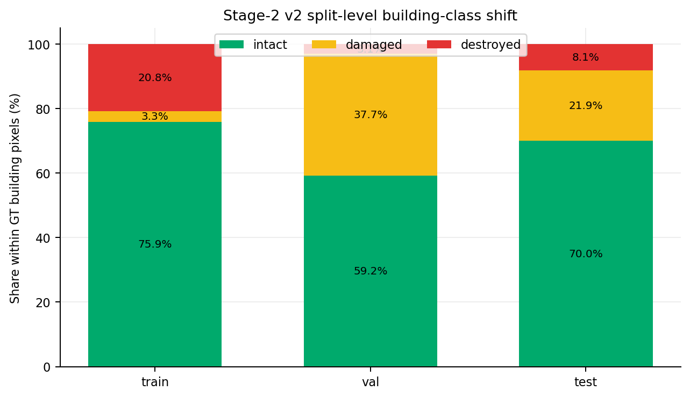
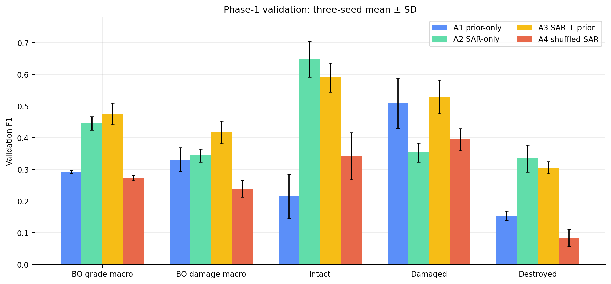
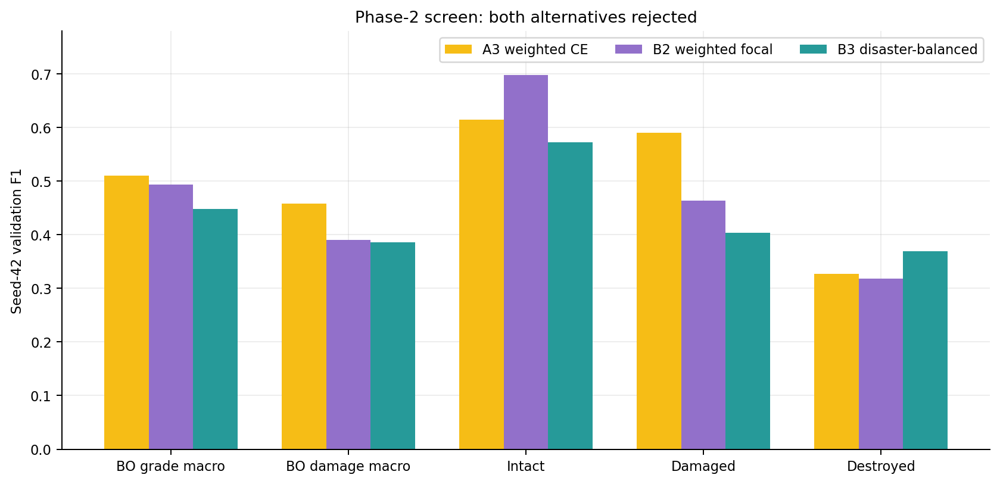
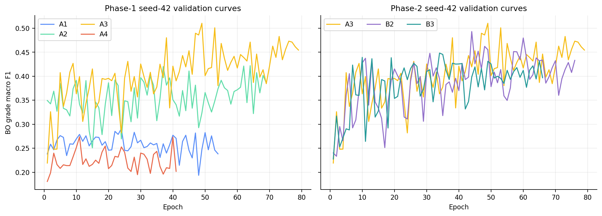
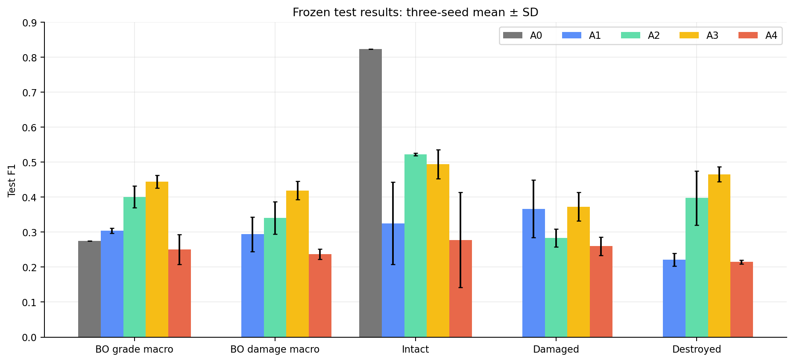
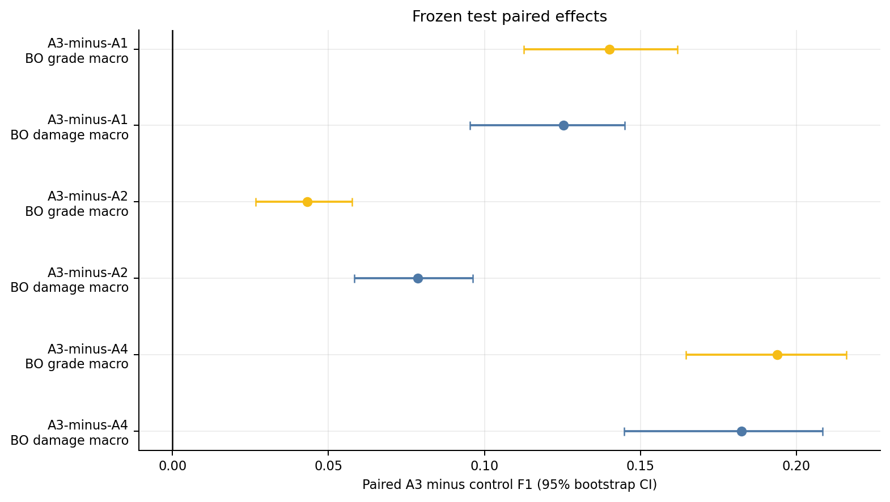
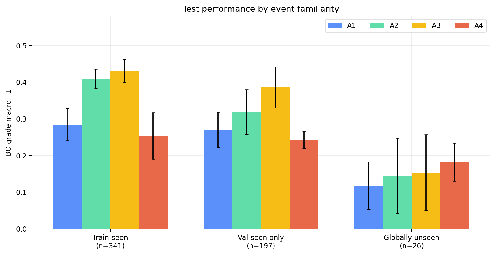
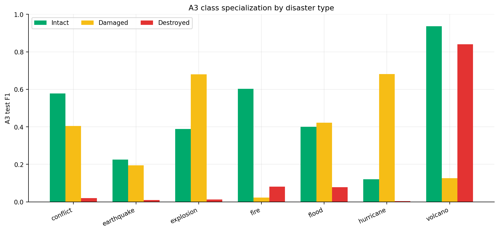
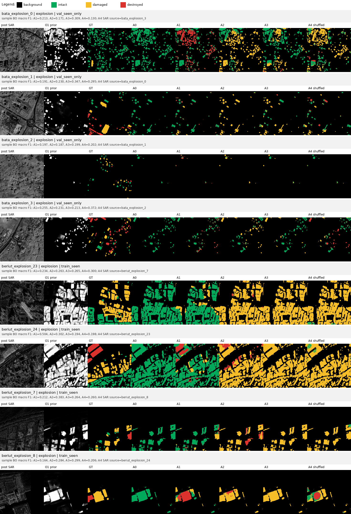
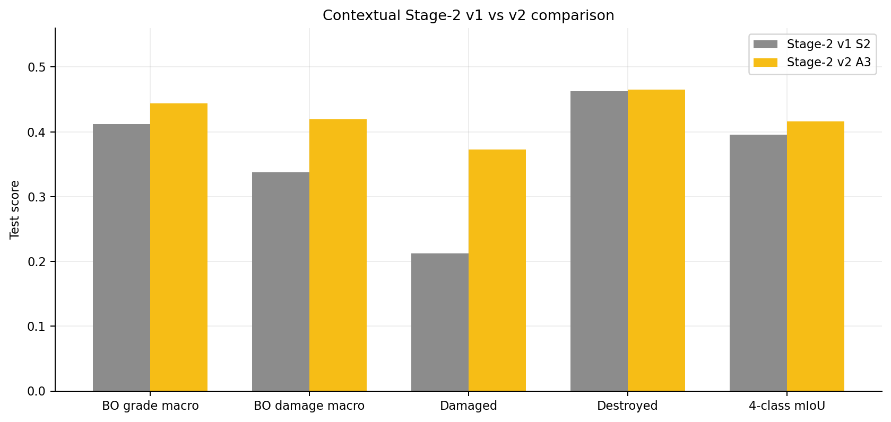

# [已更正] Stage-2 v2 实验复盘与结果报告

原始日期：2026-06-21  
更正日期：2026-06-22  
状态：legacy validation 记录保留；legacy test 因完整内容泄漏被撤回。exact/event-disjoint strict-v1 已构建；唯一 strict train-test medium 候选已确认为 no-data 误报，overlap-reviewed manifest 已形成并复审通过。权威更正见 `DATA_INTEGRITY_CORRECTION_20260622.md` 和 `STAGE2_OVERLAP_AUDIT_REPORT.md`。

## 0. 结论摘要

2026-06-22 的完整 SHA-256 审计推翻了原 test 结论：legacy 2613 行中有 661 个完整内容重复组，其中 105 个是 train-test 完全重复。旧 test 主表、图表、per-event 排名和 v1-v2 test 对比全部撤回。

当前只能支持以下较弱结论：

1. legacy train 与 legacy val 没有 event overlap 或完整内容重复，A3 在 validation 上相对 A1/A4 的优势仍是有效的开发阶段证据；
2. 排除 105 个精确重复 test 样本后的 post-hoc 诊断中，A3−A4 grade macro 仍为 `+0.0442 [0.0281, 0.0601]`，但 A3−A1 仅为 `+0.0089 [-0.0086, 0.0265]`；
3. 该 post-hoc 子集不能充当新正式 test。必须在全局去重且 canonical-event-disjoint 的 strict-v1 split 上重新训练 A1–A4。

strict-v1 已构建为 `1207/357/388` 个 train/val/test 样本，完整内容重复和 event overlap 均为 0。2026-06-24 用户完成 overlap review 后，正式训练 manifest 为 `stage2_v2_clean_human_reviewed_20260624`；strict train-test medium/low 均判定为 not overlap，双方保留。本轮没有启动新训练。

## 1. 任务背景与 v2 的修正目标

项目主流程为：

```text
Stage-1: pre-event optical RGB -> binary building prior
Stage-2: post-event SAR + building prior -> intact / damaged / destroyed
最终输出: background / intact / damaged / destroyed
```

Stage-2 v1 已证明 prior 对完整四分类空间支持有帮助，但仍有三个关键缺口：

- 损伤分级与背景分割耦合，难以区分“建筑找得准”和“建筑内等级判得准”；
- 缺少多 seed 和固定 negative control，无法排除训练随机性、prior bias 与 event bias；
- 旧 split 审计没有检查改名后的全内容重复，无法保证 test 独立性。

因此 v2 将主任务明确为 **GT building pixels 内的 intact/damaged/destroyed 三分类**，完整四分类 predicted-gate 指标作为部署辅助指标；同时引入 prior-only、SAR-only、固定同事件 shuffled-SAR、多 seed、成对 bootstrap 和 event-familiarity 分层。

## 2. 实验全过程

| 阶段 | 时间 | 工作与决策 | 结果 |
| --- | --- | --- | --- |
| 方案审计 | 2026-06-20 | 检查 v1 缺口、数据分布、split overlap、实例标签和统计协议 | 原方案修订为 building-only 三分类与受控识别性实验 |
| 运行环境恢复 | 2026-06-20 | 恢复 Stage-2 minimal 数据、NVIDIA runtime 和 `sam3` CUDA | PyTorch `2.7.0+cu126`，两张 RTX 4090 D 可用 |
| Phase 0 | 2026-06-20 | 旧路径/ID 审计、回归测试、A3/A4 CUDA smoke、两 batch overfit | 运行检查通过，但旧审计后来被证明不完整 |
| Phase 1 seed 42 | 2026-06-20 | A1–A4 单 seed 验证 | A3 明显领先，识别性方向成立 |
| Phase 1 三 seed | 2026-06-20 至 21 | seeds `42/3407/2026`，共 12 个正式训练 | A3 对 A1/A4 的验证增益稳定且 bootstrap CI 全为正 |
| Phase 2 | 2026-06-21 | seed 42 单因素筛选 B2 focal、B3 disaster-balanced sampler | 两者均未改善整体损伤等级平衡，拒绝 |
| 配方冻结 | 2026-06-21 | 仅根据 validation 冻结 A3 weighted CE | test 前完成，未发生 test-driven tuning |
| legacy test | 2026-06-21 | A1–A4 三 seed 主 checkpoint 各评估一次 | 2026-06-22 因内容泄漏整体撤回 |
| 报告与可视化 | 2026-06-21 | 汇总中间与最终结果，生成定量图和同样本预测对照图 | 本报告及 `reports/stage2_v2/assets/` |
| 数据完整性更正 | 2026-06-22 | 全内容 SHA-256、全局去重、canonical-event 重分割 | legacy test 撤回；strict-v1 通过 0-hard-error 审计 |

最初由 Codex 启动后按用户要求停止的两个 seed-42 诊断目录没有 `completed.json`，没有恢复、比较或纳入统计。正式 launcher 为每次运行建立唯一 `run_YYYYMMDD_HHMMSS` 目录，只有存在 `completed.json` 的运行才进入汇总。

## 3. Phase 0：数据与实现验收

### 3.1 数据审计

旧审计曾将 `1543/506/564` 个 legacy train/val/test 判为 `0 hard errors`，这是错误结论。它只检查相同路径和同 ID 内容，没有发现改名后的重复。修复后的全内容审计结果为：

- 661 个完整内容重复组和 661 个重复行；
- 其中 105 个为 train-test 完全重复，556 个为 split 内重复；
- `spain_volcano` 与 `la_palma_volcano` 存在大量完全相同内容，必须视为 canonical event alias；
- legacy test 与 train/val 均存在 event overlap；
- legacy train 与 legacy val 本身仍无 event overlap 和完整内容重复。

下图和下表仅描述已撤回的 legacy split 分布，不代表 strict-v1：



| Split | 图像数 | Intact | Damaged | Destroyed |
| --- | ---: | ---: | ---: | ---: |
| train | 1543 | 75.93% | 3.27% | 20.80% |
| val | 506 | 59.24% | 37.70% | 3.07% |
| test | 564 | 69.97% | 21.90% | 8.13% |

strict-v1 从三 split 并集全局去重后得到 1952 个唯一内容样本，重新分为 train/val/test `1207/357/388`；三者 event overlap、路径 overlap 以及每个核心字段的内容重复均为 0。详细分布见更正报告。

### 3.2 实现与运行验收

Phase 0 的通过项如下：

- background 不参与 building-only loss 的 synthetic test；
- BO 三分类、damage macro、binary damage 和四分类 gate 指标回归测试；
- 固定 permutation 的可复现性、自配对禁止和 singleton 策略测试；
- A3 paired SAR 与 A4 shuffled SAR 的真实 CUDA smoke；
- 1024×1024 validation、batch size 4 推理 smoke；
- 固定 2-batch、30 epoch overfit：train loss `1.562 -> 0.574`，BO grade macro F1 `0.297 -> 0.775`。

这些检查确认了数据、目标、loss、metric、shuffle control、模型反向传播和显存路径均可运行；smoke/overfit 数值不作为正式实验结果。

## 4. 固定训练与评估协议

主模型是 U-Net ResNet34，输出 3 个 grade logits。A3 的固定配置为：

| 项目 | 配置 |
| --- | --- |
| 输入 | post-SAR + O1 predicted building prior |
| 输出 | intact / damaged / destroyed 三分类 |
| loss support | GT building pixels |
| loss | median-frequency weighted CE，权重上限 8 |
| crop | 512×512；damaged/destroyed/building = 0.4/0.4/0.2 |
| batch | train 8，eval 4，8 workers，AMP |
| optimizer | learning rate `1e-4`，weight decay `1e-4`，cosine schedule |
| 训练上限 | 100 epochs；min epochs 40；3-epoch moving-average early stopping，patience 30 |
| 主 checkpoint | `best_bo_grade_macro_f1.pth` |
| 正式 seeds | 42、3407、2026 |

主指标为：

```text
BO grade macro F1 = mean(F1_intact, F1_damaged, F1_destroyed)
```

同时报告 BO damage macro、binary damage、每类 F1、predicted-gate 四分类 macro F1/mIoU、per-disaster 和 per-event。项目目标是像素级四分类语义输出，CC-surrogate 不再作为主实验要求。所有模型选择必须只使用 strict-v1 train/val。

## 5. Phase 1：最小识别性实验

| ID | 输入/规则 | 作用 |
| --- | --- | --- |
| A0 | all-intact rule | 无损伤识别能力的规则下限 |
| A1 | predicted prior only | prior 与数据偏置能解释多少 |
| A2 | post-SAR only | 单时相 SAR 独立提供多少信号 |
| A3 | paired post-SAR + predicted prior | 主部署输入 |
| A4 | fixed within-event shuffled SAR + predicted prior | 排除 prior 和事件级 SAR 分布，只破坏样本对应关系 |

A4 的置换在训练前固定并保存，同一运行全程不变；同事件内尽量 derange。test 中 `hawaii_wildfire` 只有一个样本，因此按预声明策略从 A4 排除，A4 为 563 张，其他实验为 564 张；成对分析自动取共同 `(split,id)`。

### 5.1 三 seed 验证集结果



| 实验 | BO grade macro | Intact | Damaged | Destroyed | Damage macro |
| --- | ---: | ---: | ---: | ---: | ---: |
| A1 prior-only | 0.2927 ± 0.0044 | 0.2149 ± 0.0698 | 0.5095 ± 0.0797 | 0.1537 ± 0.0145 | 0.3316 ± 0.0373 |
| A2 SAR-only | 0.4455 ± 0.0212 | **0.6477 ± 0.0560** | 0.3538 ± 0.0299 | **0.3349 ± 0.0429** | 0.3444 ± 0.0208 |
| A3 paired SAR + prior | **0.4751 ± 0.0341** | 0.5906 ± 0.0462 | **0.5292 ± 0.0530** | 0.3056 ± 0.0189 | **0.4174 ± 0.0355** |
| A4 shuffled SAR + prior | 0.2731 ± 0.0086 | 0.3414 ± 0.0740 | 0.3943 ± 0.0344 | 0.0836 ± 0.0265 | 0.2389 ± 0.0266 |

验证集成对 bootstrap 的主要结果：

- A3−A1 grade macro：`+0.1824 [0.1550, 0.2062]`；
- A3−A4 grade macro：`+0.2020 [0.1672, 0.2313]`；
- A3−A2 grade macro：`+0.0296 [0.0103, 0.0515]`；
- A3−A4 的 intact/damaged/destroyed 三类 CI 均严格大于 0。

因此 Phase-1 的 SAR correspondence 识别性门槛通过。但 A3 并非每类都优于 A2：A3 相对 A2 的 intact F1 降低 `0.0571`，damaged F1 提高 `0.1753`，destroyed 差异不确定。prior 改善的是总体损伤类别平衡，不是对所有类别都单调增益。

### 5.2 验证集暴露出的事件/类别集中

四个 event-held-out validation 事件中，A3 对 A1/A4 的 grade macro 增益方向都为正，说明总体增益不是只由一个事件产生。但类别性能高度集中：

- `rwanda_volcano`：intact/damaged/destroyed = `0.8933/0.0632/0.7827`；
- `mexico_hurricane`：`0.1822/0.7751/0.0147`；
- `ukraine_conflict`：`0.5750/0.4288/0.0078`。

即 destroyed 几乎由 Rwanda 支撑，damaged 主要由 Mexico/Ukraine 支撑。这个问题触发了 Phase 2，而不是直接在 test 上确认 A3。

## 6. Phase 2：训练策略筛选与冻结决策

Phase 2 只改变一个因素，并只运行 seed 42：

- B2：weighted CE 改为 weighted focal CE，`gamma=2.0`；
- B3：保留 weighted CE，加入 `n_d^-0.5` disaster-balanced image sampling。



| Recipe | BO grade macro | Intact | Damaged | Destroyed | Damage macro |
| --- | ---: | ---: | ---: | ---: | ---: |
| A3 weighted CE | **0.5103** | 0.6140 | **0.5903** | 0.3264 | **0.4584** |
| B2 weighted focal | 0.4930 | **0.6974** | 0.4638 | 0.3178 | 0.3908 |
| B3 disaster-balanced | 0.4482 | 0.5720 | 0.4035 | **0.3692** | 0.3863 |

B2 的 damaged F1 相对 A3 下降 `0.1265 [-0.1585, -0.0966]`；B3 的 grade macro 和 damage macro 分别下降 `0.0621` 和 `0.0720`，其 destroyed 小幅上升的区间覆盖 0。两者都没有解决事件/类别 trade-off，因此被拒绝，未浪费另外两个 seed，也未在 test 上评估。



曲线表明 validation 波动较大，单一 epoch 的局部峰值并不稳定；保存原始最佳 checkpoint、使用三 seed 复现和最终成对统计是必要的。最终冻结的是原始 A3 weighted CE，不是曲线末尾 epoch，也不是由 test 选择的候选。

## 7. 已撤回的 legacy test 结果

> 本节及第 8–11 节的 legacy test 数字与图均已撤回，只保留为问题追溯记录，不得引用为模型性能。



| 实验 | BO grade macro | Intact | Damaged | Destroyed | Damage macro | Binary damage | Pred-gate macro4 | Pred-gate mIoU |
| --- | ---: | ---: | ---: | ---: | ---: | ---: | ---: | ---: |
| A0 all-intact | 0.2744 | **0.8233** | 0.0000 | 0.0000 | 0.0000 | 0.0000 | 0.4074 | 0.3580 |
| A1 prior-only | 0.3042 ± 0.0075 | 0.3251 ± 0.1176 | 0.3664 ± 0.0822 | 0.2211 ± 0.0180 | 0.2938 ± 0.0497 | 0.4242 ± 0.0655 | 0.4308 ± 0.0025 | 0.3436 ± 0.0019 |
| A2 SAR-only | 0.4009 ± 0.0314 | 0.5218 ± 0.0037 | 0.2837 ± 0.0255 | 0.3974 ± 0.0775 | 0.3405 ± 0.0467 | 0.3837 ± 0.0249 | 0.4993 ± 0.0215 | 0.3927 ± 0.0160 |
| A3 paired SAR + prior | **0.4442 ± 0.0188** | 0.4944 ± 0.0410 | **0.3728 ± 0.0407** | **0.4655 ± 0.0215** | **0.4191 ± 0.0258** | **0.4751 ± 0.0414** | **0.5322 ± 0.0112** | **0.4158 ± 0.0089** |
| A4 shuffled SAR + prior | 0.2507 ± 0.0425 | 0.2777 ± 0.1358 | 0.2598 ± 0.0262 | 0.2145 ± 0.0052 | 0.2372 ± 0.0150 | 0.4053 ± 0.0097 | 0.3999 ± 0.0267 | 0.3234 ± 0.0177 |

这些数值来自受污染的 legacy test，不能因跨 seed 一致而恢复有效性。

### 7.1 成对效应量



| 比较 | BO grade macro 增益 | BO damage macro 增益 |
| --- | ---: | ---: |
| A3−A1 | +0.1400 [0.1127, 0.1618] | +0.1254 [0.0954, 0.1450] |
| A3−A2 | +0.0433 [0.0266, 0.0576] | +0.0786 [0.0582, 0.0962] |
| A3−A4 | +0.1938 [0.1646, 0.2161] | +0.1823 [0.1448, 0.2084] |

原来的 per-class 与 control 解释均被撤回。排除 105 个精确重复后的 post-hoc 结果见更正报告；它也不能替代 strict-v1 正式 test。

## 8. 已撤回的事件熟悉度与灾种分析



| Test 分层 | 图像数 | A1 | A2 | A3 | A4 | A3 intact / damaged / destroyed |
| --- | ---: | ---: | ---: | ---: | ---: | ---: |
| train-seen event | 341 | 0.2843 | 0.4095 | **0.4309** | 0.2536 | 0.4925 / 0.2199 / 0.5804 |
| val-seen-only event | 197 | 0.2703 | 0.3188 | **0.3860** | 0.2432 | 0.5322 / 0.6164 / 0.0094 |
| globally unseen event | 26 | 0.1179 | 0.1451 | 0.1541 | **0.1823** | 0.3226 / 0.0896 / 0.0500 |

该分层只依据 event-ID 字符串，并漏掉改名后的完整重复内容，因此整体撤回。



典型灾种表现进一步揭示 shortcut：

- volcano：`0.9361/0.1256/0.8401`；
- hurricane：`0.1196/0.6807/0.0033`；
- earthquake：`0.2250/0.1940/0.0102`。

这些灾种数字来自受污染的 legacy test，只作为历史问题追踪，不再形成模型结论。

## 9. 已撤回 legacy test 的定性可视化

下图使用正式 seed-42 test 已保存的同样本 preview 重组，列顺序为 paired post-SAR、O1 prior、GT、A0、A1、A2、A3、A4。绿色/黄色/红色分别为 intact/damaged/destroyed；A0 表示 predicted-prior gate 内全部预测 intact。每行同时标出样本级 BO grade macro F1 和 A4 实际使用的 shuffled SAR source。



这组图可以看到三种现象：

1. A3 在部分 Bata 样本上明显优于 A4，例如 `bata_explosion_0` 为 `0.309` 对 `0.130`，说明对应 SAR 的作用可以落实到空间预测，而不只存在于总表。
2. 样本间波动很大；`bata_explosion_3`、`beriut_explosion_23` 上 A4 反而更高，表明总体统计优势不等于逐样本一致获胜。
3. `beriut_explosion_24` 上 A1 为 `0.504`、A3 仅 `0.194`，A2/A3/A4 大面积预测 damaged，展示了事件/类别偏置和 prior-only 偶然命中的失败模式。

正式 evaluator 只保存按 manifest 顺序最前面的 8 张 preview，因此该 contact sheet 全部来自 explosion，**不能作为灾种代表性抽样，也不能替代全 test 定量统计**。它的作用是解释预测形态和 negative control。每行单图及数据在 `assets/qualitative_saved_previews/` 和 `assets/saved_preview_visualization_samples.csv`。

## 10. 项目输出范围

项目主输出是像素级 `background/intact/damaged/destroyed` 语义图。BO 指标是 GT building pixels 内的像素分类诊断，不是实例级评价。旧 CC-surrogate 和旧 predicted-gate test 数值都属于已撤回 test 的历史附属产物，不参与 strict-v1 主实验验收。

## 11. 已撤回的 Stage-2 v1-v2 test 对比



| 指标 | v1 S2 | v2 A3 | 变化 |
| --- | ---: | ---: | ---: |
| BO grade macro F1 | 0.4120 | 0.4442 | +0.0322 |
| BO damage macro F1 | 0.3376 | 0.4191 | +0.0815 |
| Damaged F1 | 0.2127 | 0.3728 | +0.1601 |
| Destroyed F1 | 0.4626 | 0.4655 | +0.0029 |
| Predicted-gate 4-class mIoU | 0.3953 | 0.4158 | +0.0205 |

该对比的 v2 一侧来自受污染的 legacy test，因此整体撤回。

## 12. 过程复盘

### 12.1 有效的做法

- **验证集冻结。** B2/B3 的拒绝和 A3 的选择均发生在 test 前；这一过程记录仍可保留。
- **固定 negative control。** A4 保留同事件分布但打破样本对应关系，使 SAR correspondence 成为可检验命题。
- **多 seed + 成对统计。** A3 的结论不依赖单 seed 点估计；bootstrap 直接利用相同样本的可加混淆矩阵。
- **完整运行证据。** resolved config、checkpoint、metrics history、固定置换、sample metrics、grouped metrics 和 `completed.json` 均随 run 保存。
- **明确诊断域和部署域。** BO 指标回答建筑内分级，predicted-gate 指标回答完整 pipeline；两者没有混淆。

### 12.2 没有奏效或仍不足的做法

- focal loss 提高 intact、降低 damaged，没有修复类别平衡；
- 温和 disaster-balanced sampler 略提高 destroyed，但显著损失 grade/damage macro；
- 单时相 post-SAR 缺少显式 pre/post change cue，无法消除材料、视角、散斑和事件风格；
- 当前训练/验证事件数量有限，且类别与事件强耦合；
- 现有 preview 保存策略只覆盖 manifest 前 8 张，不适合直接做代表性定性抽样；
- 旧审计只检查路径和同 ID 哈希，漏掉 661 个改名后的完整内容重复组；这是本轮最关键的流程失败；
- minimal package 未传播 QC 标签，限制了标签质量分层。

### 12.3 工程执行经验

- 正式训练必须使用 `sam3`、CUDA runtime check 和独立 tmux/log，不能在 Codex 前台长时间运行；
- GPU/CUDA 必须以宿主机检查为准，普通 sandbox 内 `torch.cuda.is_available()==False` 不能被解释为服务器故障；
- 无 `completed.json` 的中断目录必须排除，避免与正式 run 混淆；
- A4 的 singleton 规则和 permutation 文件必须随运行保存，否则 negative control 不可复现。

## 13. 可支持与不可支持的结论

当前只可支持：legacy event-held-out validation 上 A3 相对 A1/A4 有稳定优势。不能再据此声明正式 test 性能、部署泛化或 v1-v2 test 提升。新的科学结论必须等待 strict-v1 A1–A4 从头训练和一次性 test。

## 14. 后续实验优先级

1. 使用已经冻结并审计通过的 strict-v1 manifests，从头重跑 A1–A4 三 seed；
2. 只在 strict-v1 validation 选择配方，冻结后一次性 test；
3. 增加近重复/空间重叠审计，并在重建 minimal package 时传播 QC；
4. 之后再考虑 pre/post temporal cue、alignment 和损伤边界质量；
5. 改造 evaluator 的 preview 选择：训练前固定跨灾种样本清单。

## 15. 复现与产物

生成本报告定量图：

```bash
cd '/home/yr/code/Building damage change detection/stage1_optical_building'
MPLCONFIGDIR=/tmp/stage2_v2_matplotlib \
  /home/yr/miniconda3/envs/sam3/bin/python \
  tools/export_stage2_v2_report.py --quantitative-only
```

从正式 seed-42 test preview 重建同样本对照图，不需要 GPU：

```bash
MPLCONFIGDIR=/tmp/stage2_v2_matplotlib \
  /home/yr/miniconda3/envs/sam3/bin/python \
  tools/export_stage2_v2_report.py --saved-preview-only
```

legacy 产物均为历史记录。更正后的主要机器可读产物：

- `outputs/stage2/v2_data_integrity_20260622/legacy_split_full_hash_audit.json`
- `outputs/stage2/v2_data_integrity_20260622/strict_v1_full_audit.json`
- `outputs/stage2/v2_data_integrity_20260622/legacy_test_exact_duplicate_filtered.json`
- `manifests/stage2_v2_strict_v1/`
- `configs/stage2_v2_strict_v1/`

阶段性文本记录：

- `PREFLIGHT_AND_RUNBOOK.md`
- `PHASE1_RESULTS_20260621.md`
- `PHASE2_SCREEN_RESULTS_20260621.md`
- `[RETRACTED] FINAL_RESULTS_20260621.md`
- `DATA_INTEGRITY_CORRECTION_20260622.md`

`DATA_INTEGRITY_CORRECTION_20260622.md` 是当前权威状态。strict-v1 正式训练完成前不存在可引用的 Stage-2 v2 最终 test 主表。
